# Google OAuth Login (구글 계정으로 로그인)
구글 계정을 통한 소셜로그인 테스트 예제 (REST API)

<br/>

## 구글 프로젝트 설정
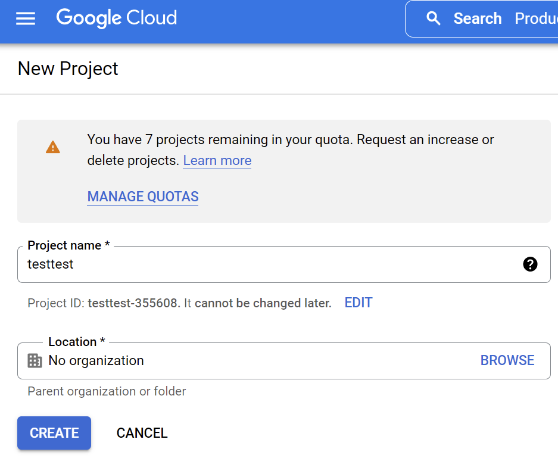

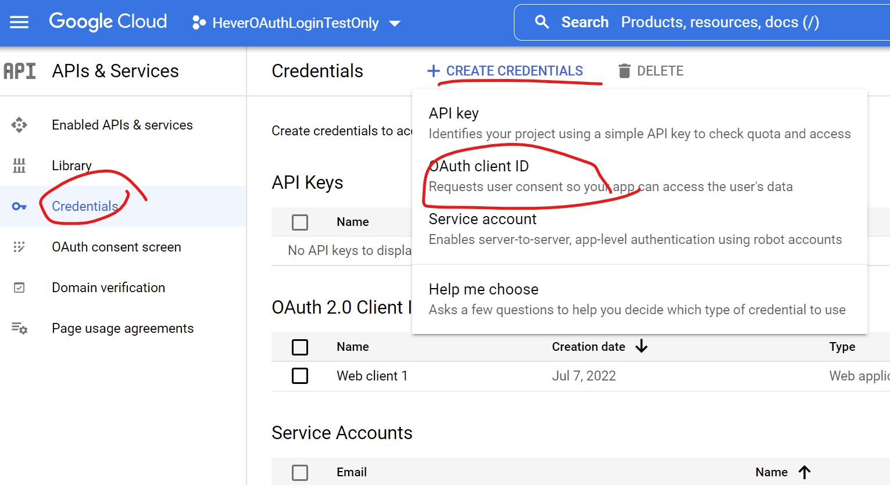

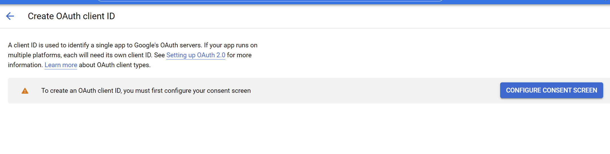

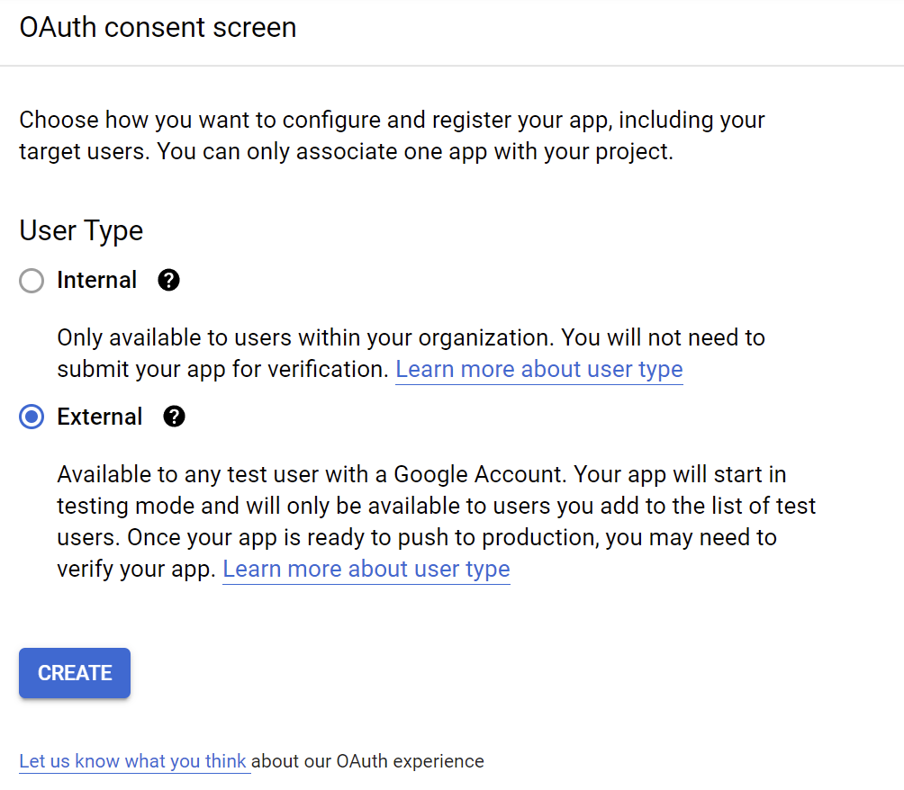

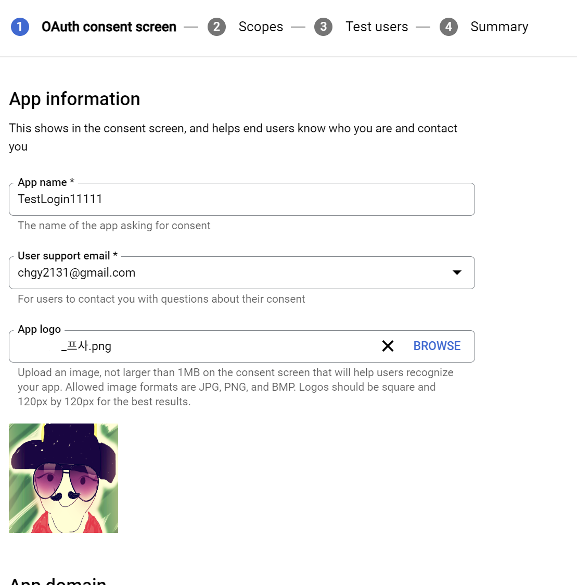

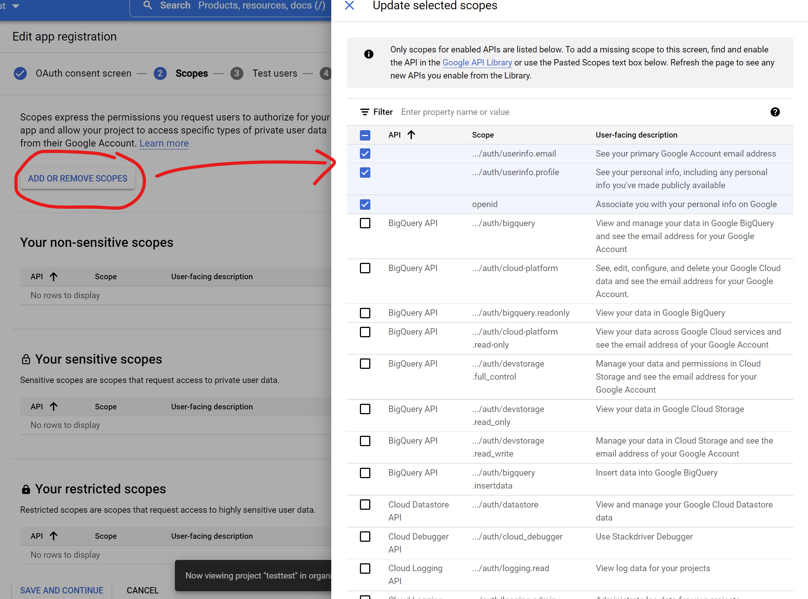

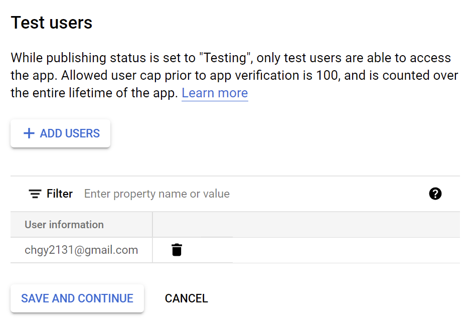

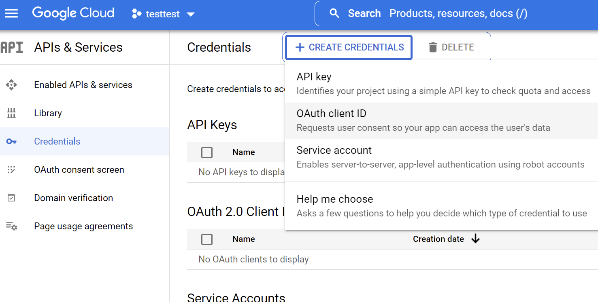

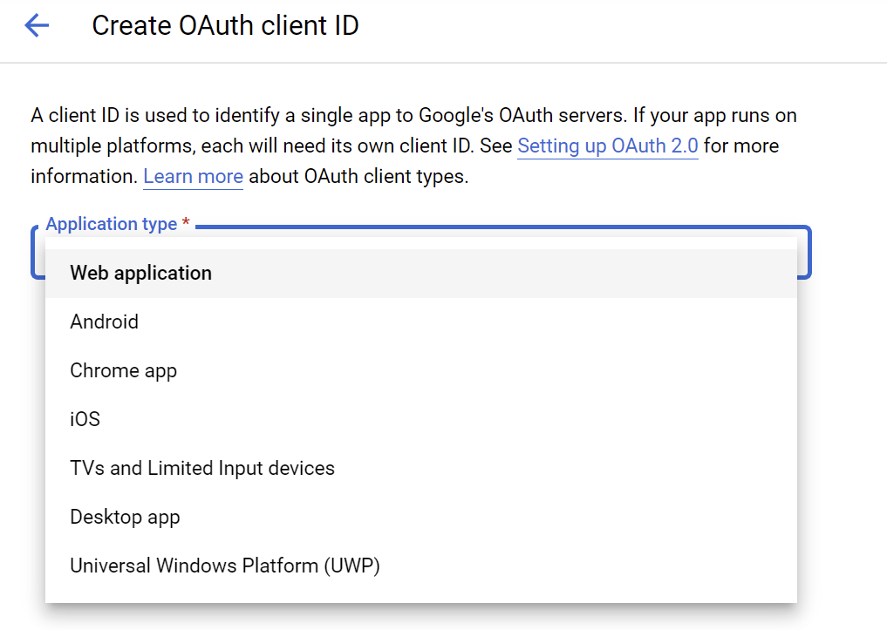

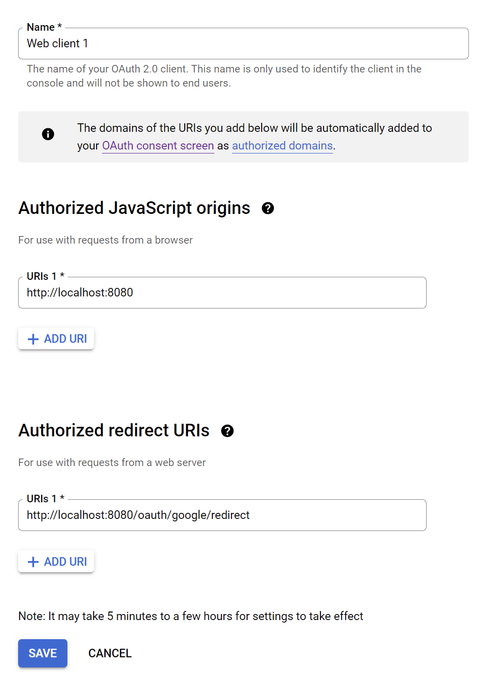

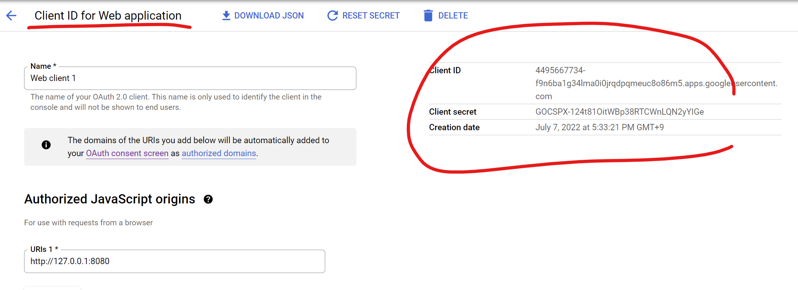


<br/>

## 실행결과

### @GetMapping("/test")
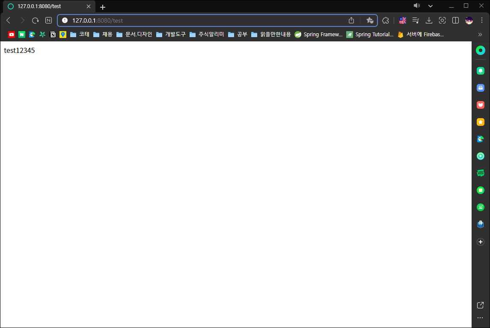

### @GetMapping("/googleConfig")
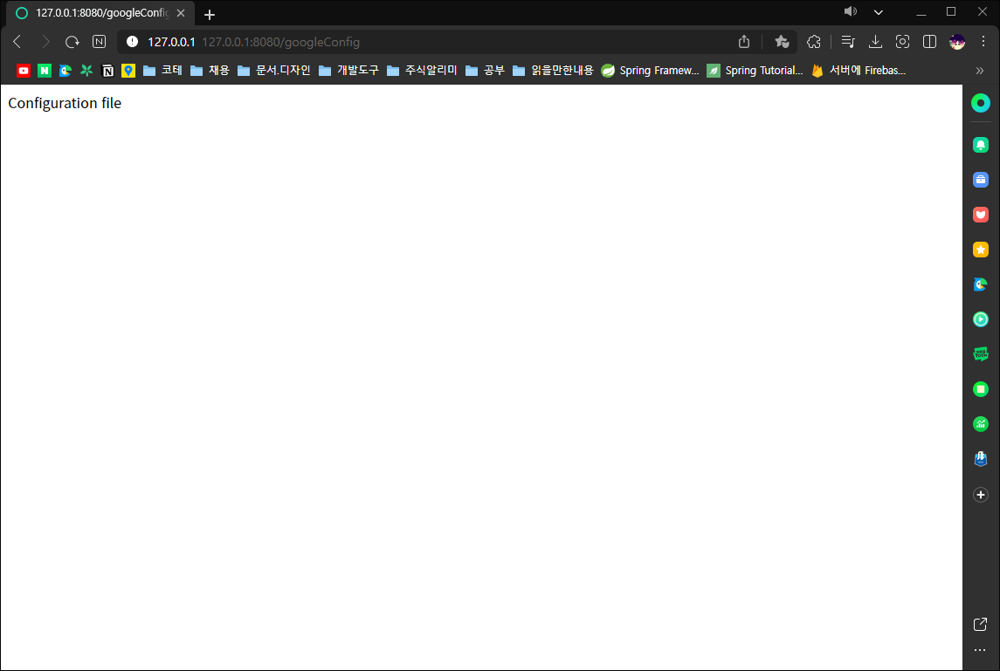
```json
GoogleOAuthConfigUtils(clientId=4495667734-f9n6ba1g34lma0i0jrqdpqmeuc8o86m5.apps.googleusercontent.com, secretKey=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, authUrl=https://oauth2.googleapis.com, loginUrl=https://accounts.google.com, redirectUrl=http://localhost:8080/google/login/redirect)
```

### @GetMapping(value = "/oauth/google/login")
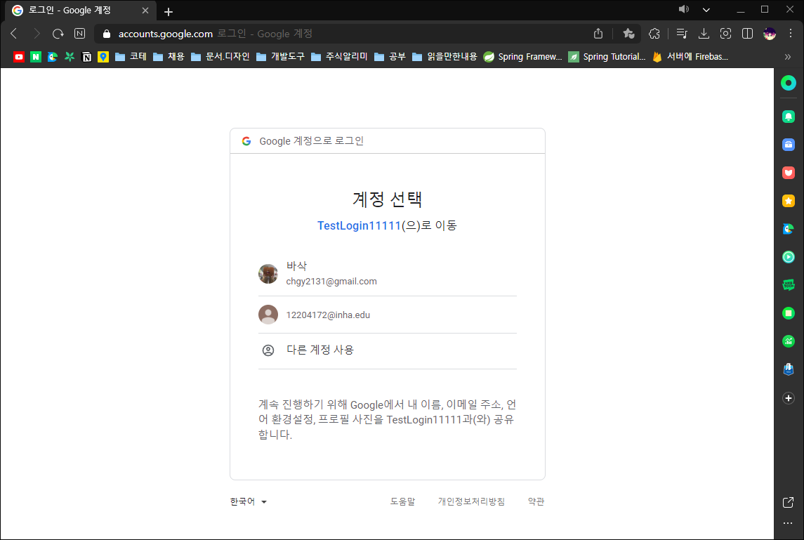

### @GetMapping(value = "/oauth/google/redirect")
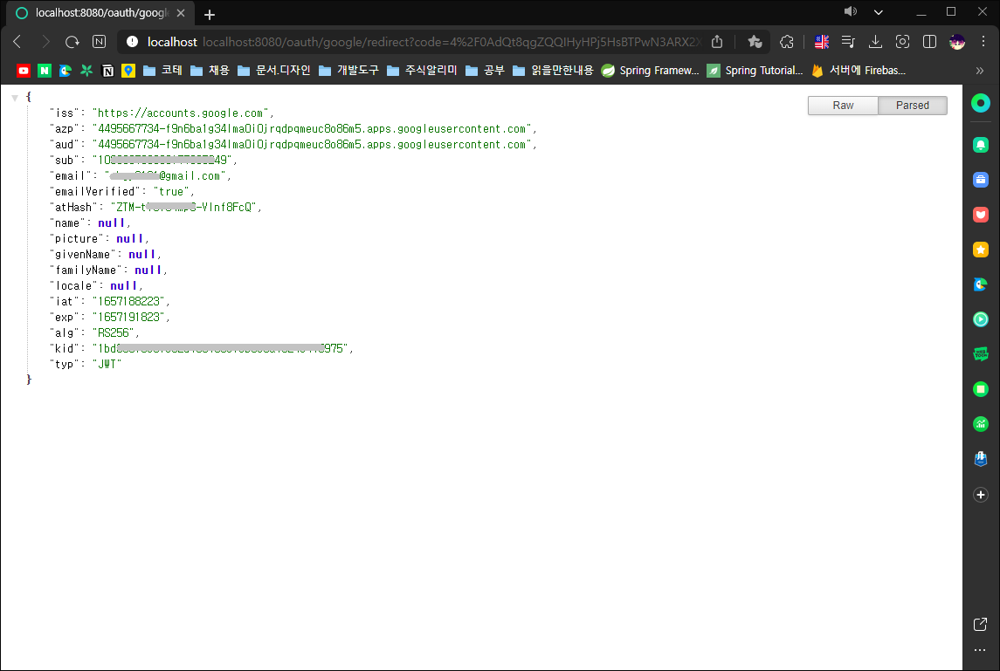
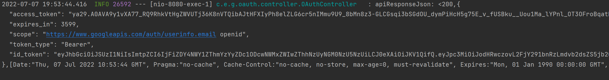
```json
{
"iss": "https://accounts.google.com",
"azp": "4495667734-f9n6ba1g34lma0i0jrqdpqmeuc8o86m5.apps.googleusercontent.com",
"aud": "4495667734-f9n6ba1g34lma0i0jrqdpqmeuc8o86m5.apps.googleusercontent.com",
"sub": "109306780083177035249",
"email": "chgy2131@gmail.com",
"emailVerified": "true",
"atHash": "ZTM-tY91U4mp6-Vlnf8FcQ",
"name": null,
"picture": null,
"givenName": null,
"familyName": null,
"locale": null,
"iat": "1657188223",
"exp": "1657191823",
"alg": "RS256",
"kid": "1bd685f5e8fc62d758705c1eb0e8a7524c475975",
"typ": "JWT"
}
```

### @GetMapping(value = "/oauth/google/userinfo")
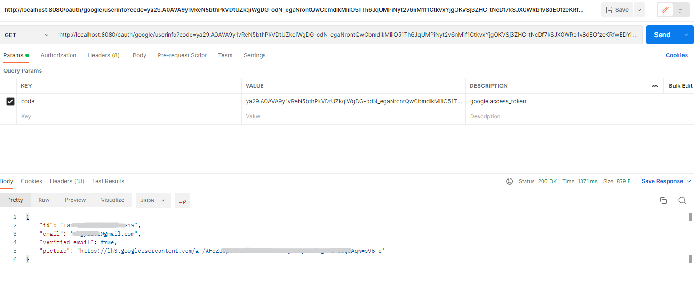
```json
{
    "id": "109xxxxxxxxxxxxxxxx249",
    "email": "xxxxxxxx@gmail.com",
    "verified_email": true,
    "picture": "https://lh3.googleusercontent.com/a-/AFdxxxxxxxxxxxxxxxxxxxxxxxxxxxxxxxxxs96-c"
}
```

<br/>

# 참고자료
- https://maivve.tistory.com/336
- https://developers.google.com/identity/protocols/oauth2
- https://developers.google.com/api-client-library/java/google-api-java-client/oauth2
- https://developers.google.com/api-client-library/java/google-oauth-java-client/oauth2
- https://mslilsunshine.tistory.com/171
- https://developers.google.com/identity/protocols/oauth2/web-server

조회할 항목 추가
- https://developers.google.com/identity/protocols/oauth2/scopes
- https://developersp.tistory.com/9
- https://www.daleseo.com/google-oauth/

people API 관련
- https://developers.google.com/people/api/rest/v1/people/get
- https://developers.google.com/people/api/rest/v1/people#Person
- https://zinisang.tistory.com/84
- https://stackoverflow.com/questions/36466050/why-cant-i-retrieve-emails-addresses-and-phone-numbers-with-google-people-api
- https://stackoverflow.com/questions/35604406/retrieving-information-about-a-contact-with-google-people-api-java