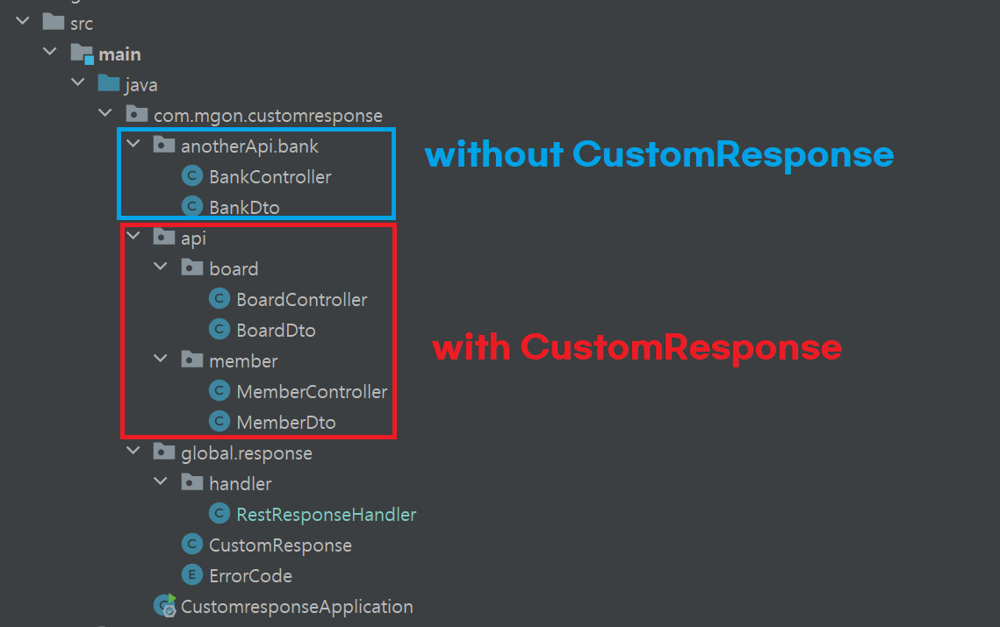
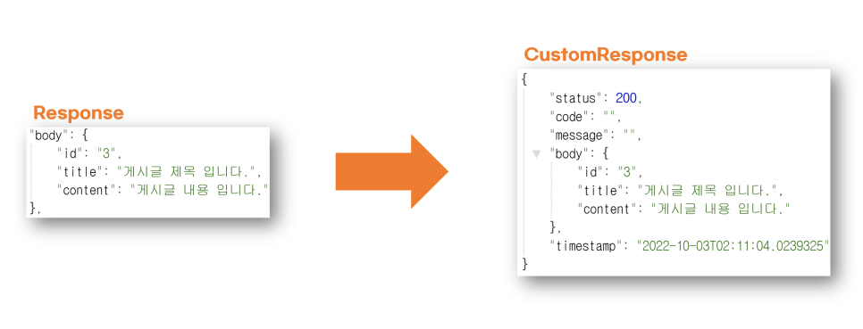

# Spring 공통 반환 예제 (Custom Response)
RestController 사용시 발생하는 json 응답을 공통 포맷에 따라 반환하는 방법을 설명함.

## 개요

### 테스트 환경
- IntelliJ
- Java 8 
- Spring Boot 2.7.4 
  - dependency 
    - spring-boot-starter-web 
    - lombok 

### 패키지 구조


</br>
</br>
</br>

## 설명

### 기대하는 형태


### 핵심코드: ResponseBodyAdvice 
이 방법은 @RestControllerAdvice 클래스에 ResponseBodyAdvice 인터페이스를 상속(implements)하여 동작 시키는 방법으로, 이 방법을 사용하여 공통반환을 적용하였다.
ResponseBodyAdvice를 상속받으면 두 함수를 구현해줘야한다. supports와 beforedBodyWrite

- supports
  - 실제 로직이 실행되기전에 조건을 검사하는 부분이다. 
  - 이 함수에 return 값이 true 이면 아래 beforedBodyWrite를 실행한다. 
  - 그러니 무지성 return true는 금물 😅
- beforedBodyWrite
  - 실제 로직이 실행되는 함수. 
  - 이곳에서 body에 직접 접근할 수 있으므로 CustomResponse 포맷으로 형식을 변환해준뒤에 return 해준다.
  
```java
@Getter
@RestControllerAdvice
public class RestResponseHandler implements ResponseBodyAdvice<Object> {
    @Override
    public boolean supports(MethodParameter returnType, Class<? extends HttpMessageConverter<?>> converterType) {
        String classPath = returnType.getContainingClass().toString();  // 현재 실행된 controller의 경로를 불러온다.
        return classPath.startsWith("class com.mgon.customresponse.api");  // controller의 경로가 프로젝트의 api 패키지 내부라면 true를 반환한다. 외부의 경우 false를 반환하는데 여기에는 swagger, exceptionHandler, util... 등이 해당되야한다.
    }

    @Override
    public Object beforeBodyWrite(Object body, MethodParameter returnType, MediaType selectedContentType, Class<? extends HttpMessageConverter<?>> selectedConverterType, ServerHttpRequest request, ServerHttpResponse response) {
        return CustomResponse.of(body);
    }
}
```

</br>
</br>
</br>

## 동작 확인
### /api/v1/board
정상적으로 공통반환이 적용됨
```json
{
"status": 200,
"code": "",
"message": "",
"body": [
{
"id": "1",
"title": "제목제목제목 001",
"content": "게시글내용테스트ㅇㅇㅇㅇㅇㅇ"
},
{
"id": "2",
"title": "제목제목제목 002",
"content": "게시글내용테스트ㅇㅇㅇㅇㅇㅇ"
},
{
"id": "3",
"title": "제목제목제목 003",
"content": "게시글내용테스트ㅇㅇㅇㅇㅇㅇ"
},
{
"id": "4",
"title": "제목제목제목 004",
"content": "게시글내용테스트ㅇㅇㅇㅇㅇㅇ"
}
],
"timestamp": "2022-10-03T02:27:13.0243209"
}
```

### /api/v1/board/123
정상적으로 공통반환이 적용됨
```json
{
"status": 200,
"code": "",
"message": "",
"body": {
"id": "123",
"title": "게시글 제목 입니다.",
"content": "게시글 내용 입니다."
},
"timestamp": "2022-10-03T02:28:12.225182"
}
```

### /api/v1/member
예외가 발생하여 ExceptionHandler 로 경로가 변경되어, 공통반환없이 출력된 모습.
```json
Whitelabel Error Page
This application has no explicit mapping for /error, so you are seeing this as a fallback.

Mon Oct 03 02:28:27 KST 2022
There was an unexpected error (type=Internal Server Error, status=500).
```

### /api/v1/member/321
정상적으로 공통반환이 적용됨
```json
{
"status": 200,
"code": "",
"message": "",
"body": {
"id": "321",
"name": null,
"email": "mgon@basak.com",
"phone": "010-1234-5678",
"address": null,
"city": null,
"state": null,
"zip": null,
"country": "KR",
"website": null
},
"timestamp": "2022-10-03T02:28:43.9418065"
}
```

### /api/v1/bank
공통반환을 적용할 패키지경로에 포함되어있지 않아, 공통반환없이 출력된 모습.
```json
{
"name": "mgon aka basak",
"money": 999999999
}
```
