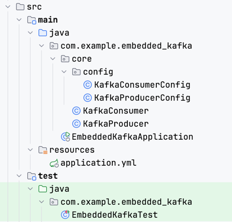

# Embedded Kafka
Spring 프로젝트에서 임베디드 카프카를 활용하는 방법

<br>

## 의존성 추가
```groovy
implementation 'org.springframework.kafka:spring-kafka:3.3.0'
testImplementation 'org.springframework.kafka:spring-kafka-test:3.3.0'
```

<br>

## 카프카 설정 추가
```yaml
spring:
  kafka:
    producer:
      bootstrap-servers: localhost:9092
    consumer:
      bootstrap-servers: localhost:9092
      auto-offset-reset: earliest
      enable-auto-commit: false
    listener:
      ack-mode: manual
```

<br>

## 관련 코드 작성


### KafkaConsumerConfig
```java
@Configuration
public class KafkaConsumerConfig {

    @Value("${spring.kafka.consumer.bootstrap-servers}")
    private String BOOTSTRAP_ADDRESS;

    @Value("${spring.kafka.consumer.auto-offset-reset}")
    private String AUTO_OFFSET_RESET;

    @Value("${spring.kafka.consumer.enable-auto-commit}")
    private boolean AUTO_COMMIT;

    @Bean
    ConsumerFactory<String,String> consumerFactory(){
        Map<String, Object> props = new HashMap<>();
        props.put(ConsumerConfig.BOOTSTRAP_SERVERS_CONFIG, BOOTSTRAP_ADDRESS);
        props.put(ConsumerConfig.AUTO_OFFSET_RESET_CONFIG, AUTO_OFFSET_RESET);
        props.put(ConsumerConfig.ENABLE_AUTO_COMMIT_CONFIG, AUTO_COMMIT);
        return new DefaultKafkaConsumerFactory<>(props, new StringDeserializer(), new StringDeserializer());
    }

    @Bean
    ConcurrentKafkaListenerContainerFactory<String, String> containerFactory(){
        ConcurrentKafkaListenerContainerFactory<String, String> factory = new ConcurrentKafkaListenerContainerFactory<>();
        factory.setConsumerFactory(consumerFactory());
        return factory;
    }

}
```

### KafkaProducerConfig
```java
@Configuration
public class KafkaProducerConfig {

    @Value("${spring.kafka.producer.bootstrap-servers}")
    private String PRODUCER_SERVERS;

    @Bean
    public ProducerFactory<String, String> factory() {
        Map<String, Object> props = new HashMap<>();
        props.put(ProducerConfig.BOOTSTRAP_SERVERS_CONFIG, PRODUCER_SERVERS);
        props.put(ProducerConfig.KEY_SERIALIZER_CLASS_CONFIG, StringSerializer.class);
        props.put(ProducerConfig.VALUE_SERIALIZER_CLASS_CONFIG, StringSerializer.class);

        return new DefaultKafkaProducerFactory<>(props);
    }

    @Bean
    KafkaTemplate<String, String> kafkaTemplate(){
        return new KafkaTemplate<>(factory());
    }

}

```

### KafkaConsumer
Link: https://docs.spring.io/spring-kafka/reference/kafka/container-props.html
```java
@Slf4j
@Component
@RequiredArgsConstructor
public class KafkaConsumer {

    public static final String TOPIC_NAME = "testTopic";
    private final List<String> stringRepository = new CopyOnWriteArrayList<>();

    @KafkaListener(topics = TOPIC_NAME, groupId = "testGroup")
    protected void consume(@Payload String payload, Acknowledgment acknowledgment) throws Exception {
        log.info("receive event: {}", payload);
        stringRepository.add(payload);

        acknowledgment.acknowledge();
    }

    public List<String> getMessages() {
        return Collections.unmodifiableList(stringRepository);
    }

}

```

### KafkaProducer
```java
@Slf4j
@Component
@RequiredArgsConstructor
public class KafkaProducer {

    private final KafkaTemplate<String, String> kafkaTemplate;

    public void send(String topic, String payload) {
        kafkaTemplate.send(topic, payload);
    }

}

```

<br>

## 테스트 코드 작성
```java
@SpringBootTest
@EmbeddedKafka(partitions = 2, brokerProperties = {"listeners=PLAINTEXT://localhost:9092"}, ports = {9092})
public class EmbeddedKafkaTest {

    @Autowired
    KafkaProducer kafkaProducer;

    @Autowired
    KafkaConsumer kafkaConsumer;

    @Test
    void test() throws Exception {
        // given
        String topic = TOPIC_NAME;
        String payload = "hello! 안녕하세요? 1234567890 !@#$%^&*()";

        // when
        kafkaProducer.send(topic, payload);  // kafka 메시지를 발행(publish)한다.

        // then
        Awaitility.await()
                .atMost(30, TimeUnit.SECONDS)  // 30초 이내에 아래 테스트 조건을 만족하지 못하면 실패한다.
                .untilAsserted(() -> {
                    List<String> messages = kafkaConsumer.getMessages();
                    Assertions.assertThat(messages).contains("hello! 안녕하세요? 1234567890 !@#$%^&*()");
                });
    }

}
```

<br/>

## 참고자료
- https://docs.spring.io/spring-kafka/reference/index.html
- https://velog.io/@wodyd202/Embedded-Kafka%EB%A5%BC-%ED%86%B5%ED%95%9C-Kafka-%ED%85%8C%EC%8A%A4%ED%8A%B8
