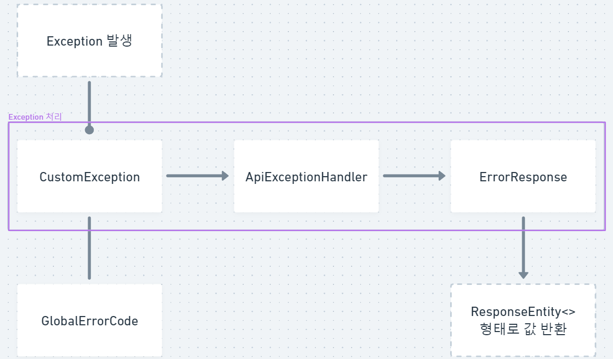

# Exception Handling Example
스프링 부트 예외처리(Exception) 예시입니다.

<br/>

## Package 구조

### Tree
```
📁 com.example.exceptionhandler
 └ 📁 api
    └ 📄 TestController
 └ 📁 common
    └ 📁 error
       └ 📁 handler 
          └ 📄 ApiExceptionHandler
       └ 📄 CustomException
       └ 📄 GlobalErrorCode
       └ 📄 ErrorResponse
```

### Diagram


<br/>

## 실행 구조


<br/>

## 실행 예시
### CustomException
Request URI : /test/exception/custom

Request Method : GET

```json
{
"status": 409,
"message": "데이터가 이미 존재합니다",
"timestamp": "2022-09-08T20:32:06.1623206"
}
```

<br/>

## 참고자료
https://bcp0109.tistory.com/303
https://www.woolog.dev/backend/spring-boot/spring-boot-exception-handling-basic/
https://velog.io/@ansalstmd/%EC%8A%A4%ED%94%84%EB%A7%81%EB%B6%80%ED%8A%B8-%EB%8B%A4%EC%96%91%ED%95%9C-%EA%B8%B0%EB%8A%A5-3.-Spring-Boot-Exception-%EC%B2%98%EB%A6%AC
https://realtree.tistory.com/39
https://velog.io/@sorzzzzy/Spring-Boot5-9.-API-%EC%98%88%EC%99%B8%EC%B2%98%EB%A6%AC
