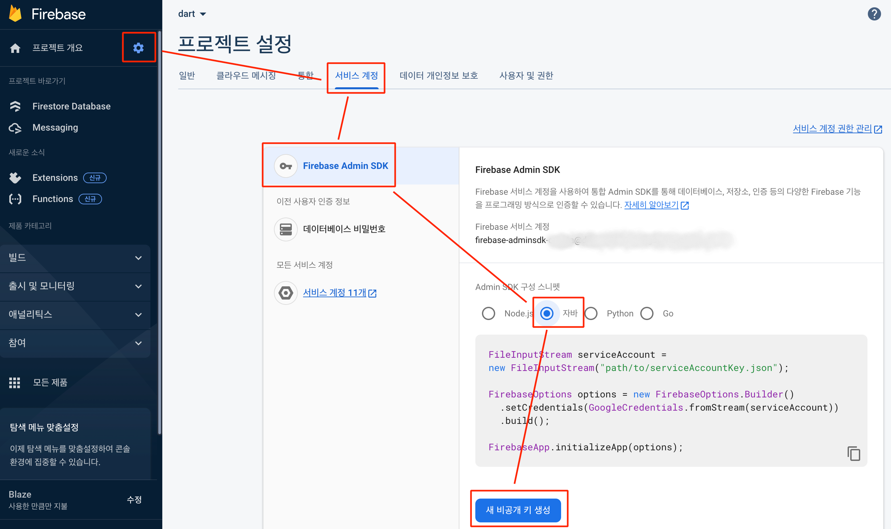
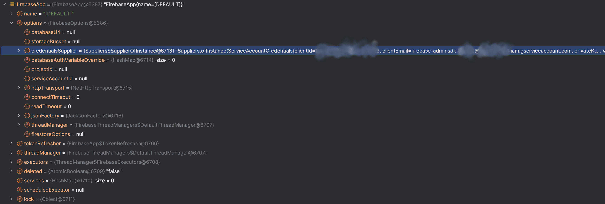
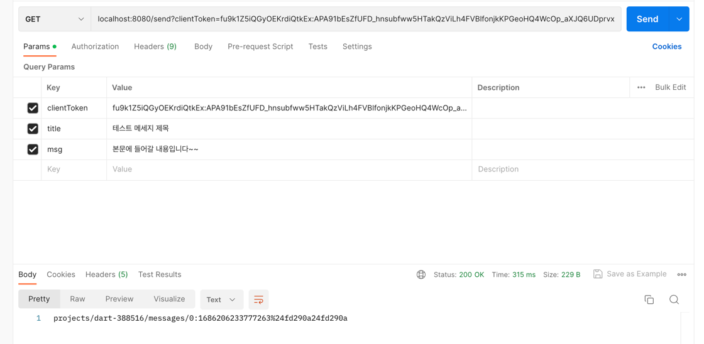
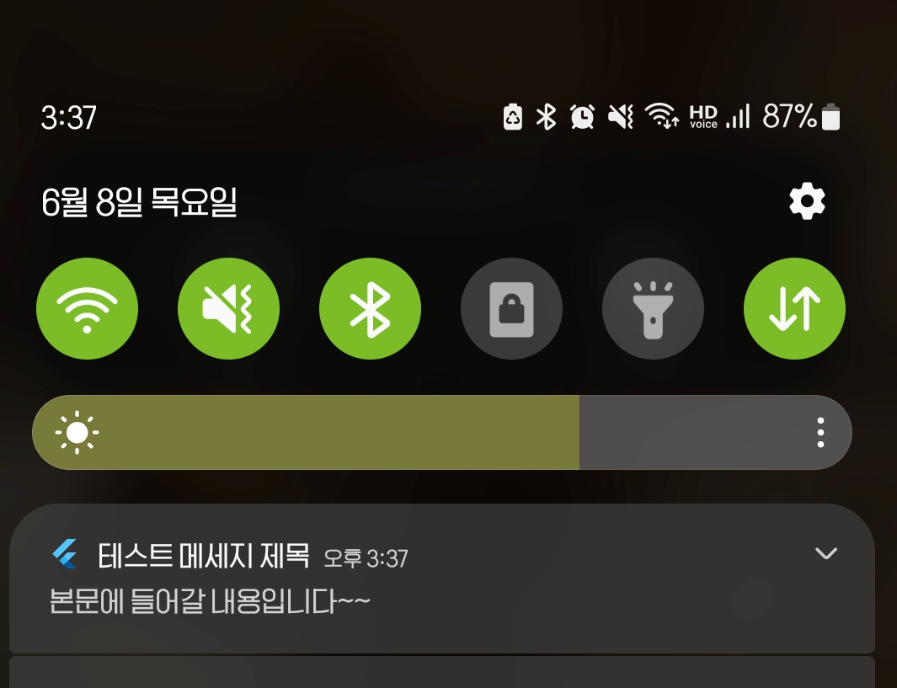
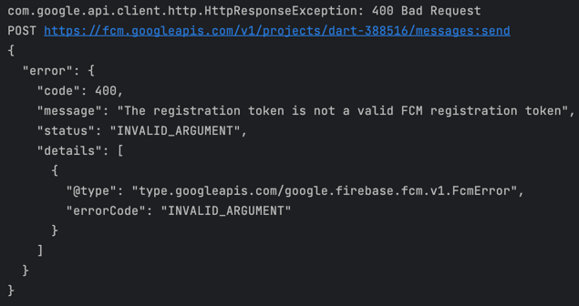

# SpringBoot FCM Tutorial
SpringBoot에서 FCM(FirebaseSDK)를 이용하여 모바일(안드로이드:Flutter) Device로 단일 Push알림을 보내는 것에 대해 설명함


<br/>

## 환경설정
### Firebase Admin SDK
- Java8 이상 필요
```groovy
dependencies {
  implementation 'com.google.firebase:firebase-admin:9.1.1'
}
```


### Firebase Service Key Json

1. Firebase Console에서 설정 > 서비스 계정을 엽니다.
2. 새 비공개 키 생성을 클릭한 다음 키 생성을 클릭하여 확인합니다.
3. 키가 들어 있는 JSON 파일을 안전하게 저장합니다.
4. 다운로드 받은 파일을 /src/main/resources/ 아래에 위치시키고 파일명을 기억합니다. (또는 path)
> 이 프로젝트를 그대로 clone하는 경우 반드시 resources 폴더에 있는 firebase~~.json을 제거하고 자신의 프로젝트에 맞는 것을 사용할 것

### FirebaseConfiguration Code
- resuorce 폴더에 있는 `.json` 설정 파일을 불러와서 초기 설정을 진행하여 Bean으로 등록합니다.
```java
@Configuration
public class FirebaseConfiguration {
    private static final String FIREBASE_JSON_PATH = "test-388516-firebase-adminsdk-abcdefghijk.json";

    @Bean
    public FirebaseApp initialize() throws IOException {
        ClassPathResource resource = new ClassPathResource(FIREBASE_JSON_PATH);
        GoogleCredentials credentials = GoogleCredentials.fromStream(resource.getInputStream());

        FirebaseOptions options = FirebaseOptions.builder()
                .setCredentials(credentials)
                .build();

        return FirebaseApp.initializeApp(options);
    }
}
```

- FirebaseApp Instance 구조



<br/>

## 단일기기에 Push 알림 전송
ps. 다음 flutter 프로젝트를 기반으로 안드로이드에서 동작을 확인함 (https://github.com/chhs2131/FlutterExample/tree/main/fcm_example)

### 전송 코드
```java
public String pushNotification(String clientToken, String title, String msg) throws FirebaseMessagingException {
    // See documentation on defining a message payload.
    Message message = Message.builder()
            .setNotification(Notification.builder()
                    .setTitle(title)
                    .setBody(msg)
                    .build()
            )
            .setToken(clientToken)
            .build();

    String response = FirebaseMessaging.getInstance().send(message);
    return response;
}
```

### 실제 동작 화면
Controller Parameter
```java
@GetMapping("/send")
public String sendMessage(
        @RequestParam String clientToken,
        @RequestParam(required = false, defaultValue = "test title") String title,
        @RequestParam(required = false, defaultValue = "test msg body") String msg
)
```

PostMan


AndroidApp



<br/>

## Error Case


### Client Tokne이 유효하지 않은 경우


## 참고자료
- https://firebase.google.com/docs/cloud-messaging/server?hl=ko
- https://github.com/firebase/firebase-admin-java/blob/7957d316b33994cef898784be2130ff0b9066f8b/src/test/java/com/google/firebase/snippets/FirebaseMessagingSnippets.java#L46-L60
- https://firebase.google.com/docs/cloud-messaging/fcm-architecture?hl=ko
