# 그랄VM 예제
- 언어: Java 22
- 프레임워크: SpringBoot 3.2
- Apple Silicon M2 Pro
- 운영체제: MacOS 14.0(Sonoma 23A344)

### 시작하기 앞서
아래 파일들은 모두 Hibernate 및 Datasource 테스트를 위한 파일들이니, 필요하지 않은 경우 삭제 또는 주석처리하여 사용할 것!
- Library, LibraryController, LibraryRepository, application.yml


# GraalVM은 어떻게 동작하는가?

nothing.


<!-- ###################################################################################################################################### -->
<!-- ###################################################################################################################################### -->
<!-- ###################################################################################################################################### -->
<br/>

# Example (순수 자바)

### GraalVM 설치하기
설치하기
https://www.graalvm.org/downloads/

### 예제 코드 작성 
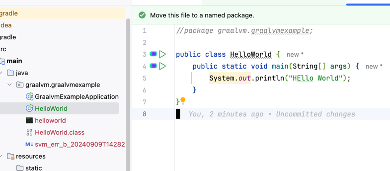

```java
// package graalvm.graalvmexample;  // <- 이것을 작성하지 않도록 주의!

public class HelloWorld {
    public static void main(String[] args) {
        System.out.println("HEllo World");
    }
}
```

### 바이트코드로 컴파일하기
`javac` 명령을 통해 바이트코드로 컴파일한다.
```shell
    ~/Doc/GitHub/SpringExample/graalvm-example/src/main/java/graalvm/graalvmexample    GraalVM +11 !4 ?43  javac HelloWorld.java                                                                                                                                                           ✔  14:28:04  
```

### NativeImage로 만들기
`native-image` 명령을 통해 플랫폼에 맞는 기계어로 변환한다. 
```shell
    ~/Doc/GitHub/SpringExample/graalvm-example/src/main/java/graalvm/graalvmexample    GraalVM +11 !4 ?44  native-image HelloWorld                                                                                                                                                         ✔  14:32:50  
========================================================================================================================
GraalVM Native Image: Generating 'helloworld' (executable)...
========================================================================================================================
[1/8] Initializing...                                                                                   (11.4s @ 0.10GB)
 Java version: 22.0.2+9, vendor version: Oracle GraalVM 22.0.2+9.1
 Graal compiler: optimization level: 2, target machine: armv8-a, PGO: off
 C compiler: cc (apple, arm64, 15.0.0)
 Garbage collector: Serial GC (max heap size: 80% of RAM)
 1 user-specific feature(s):
 - com.oracle.svm.thirdparty.gson.GsonFeature
------------------------------------------------------------------------------------------------------------------------
Build resources:
 - 12.09GB of memory (75.6% of 16.00GB system memory, determined at start)
 - 12 thread(s) (100.0% of 12 available processor(s), determined at start)
[2/8] Performing analysis...  [****]                                                                     (3.7s @ 0.19GB)
    2,056 reachable types   (59.9% of    3,430 total)
    1,849 reachable fields  (38.8% of    4,760 total)
    8,637 reachable methods (35.5% of   24,345 total)
      778 types,    25 fields, and   348 methods registered for reflection
       49 types,    33 fields, and    48 methods registered for JNI access
        4 native libraries: -framework Foundation, dl, pthread, z
[3/8] Building universe...                                                                               (0.6s @ 0.21GB)
[4/8] Parsing methods...      [*]                                                                        (0.4s @ 0.22GB)
[5/8] Inlining methods...     [***]                                                                      (0.4s @ 0.26GB)
[6/8] Compiling methods...    [***]                                                                      (6.9s @ 0.33GB)
[7/8] Laying out methods...   [*]                                                                        (0.5s @ 0.34GB)
[8/8] Creating image...       [*]                                                                        (0.9s @ 0.37GB)
   2.62MB (44.08%) for code area:     3,897 compilation units
   3.13MB (52.49%) for image heap:   51,987 objects and 71 resources
 209.35kB ( 3.43%) for other data
   5.95MB in total
------------------------------------------------------------------------------------------------------------------------
Top 10 origins of code area:                                Top 10 object types in image heap:
   1.26MB java.base                                          695.51kB byte[] for java.lang.String
   1.14MB svm.jar (Native Image)                             692.82kB byte[] for code metadata
  80.79kB com.oracle.svm.svm_enterprise                      364.24kB java.lang.String
  25.46kB org.graalvm.nativeimage.base                       332.24kB java.lang.Class
  22.27kB jdk.proxy3                                         143.75kB java.util.HashMap$Node
  21.27kB org.graalvm.collections                            122.16kB heap alignment
  19.61kB jdk.proxy1                                         114.52kB char[]
  14.85kB jdk.graal.compiler                                  86.09kB java.lang.Object[]
  14.50kB jdk.internal.vm.ci                                  80.48kB byte[] for reflection metadata
   8.26kB jdk.proxy2                                          80.31kB com.oracle.svm.core.hub.DynamicHubCompanion
  456.00B for 1 more packages                                487.87kB for 532 more object types
                              Use '-H:+BuildReport' to create a report with more details.
------------------------------------------------------------------------------------------------------------------------
Security report:
 - Binary includes Java deserialization.
 - Use '--enable-sbom' to embed a Software Bill of Materials (SBOM) in the binary.
------------------------------------------------------------------------------------------------------------------------
Recommendations:
 PGO:  Use Profile-Guided Optimizations ('--pgo') for improved throughput.
 HEAP: Set max heap for improved and more predictable memory usage.
 CPU:  Enable more CPU features with '-march=native' for improved performance.
 QBM:  Use the quick build mode ('-Ob') to speed up builds during development.
------------------------------------------------------------------------------------------------------------------------
                        1.0s (3.9% of total time) in 408 GCs | Peak RSS: 0.69GB | CPU load: 4.23
------------------------------------------------------------------------------------------------------------------------
Build artifacts:
 /Users/hyeon/Documents/GitHub/SpringExample/graalvm-example/src/main/java/graalvm/graalvmexample/helloworld (executable)
========================================================================================================================
Finished generating 'helloworld' in 25.3s.
```

### 실행하기
생성된 helloworld를 실행할 수 있다.

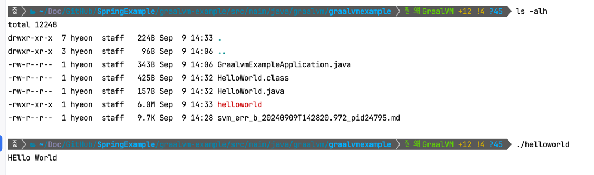


<!-- ###################################################################################################################################### -->
<!-- ###################################################################################################################################### -->
<!-- ###################################################################################################################################### -->
<br/>

# Example (with spring boot)


### gradle을 사용해서 빌드하기
graalvm build tool을 추가하고, `./gradlew nativeCompile` 명령어를 사용하여 빌드가 가능함
```groovy
plugins {
    id 'org.graalvm.buildtools.native' version '0.10.2'
}
```

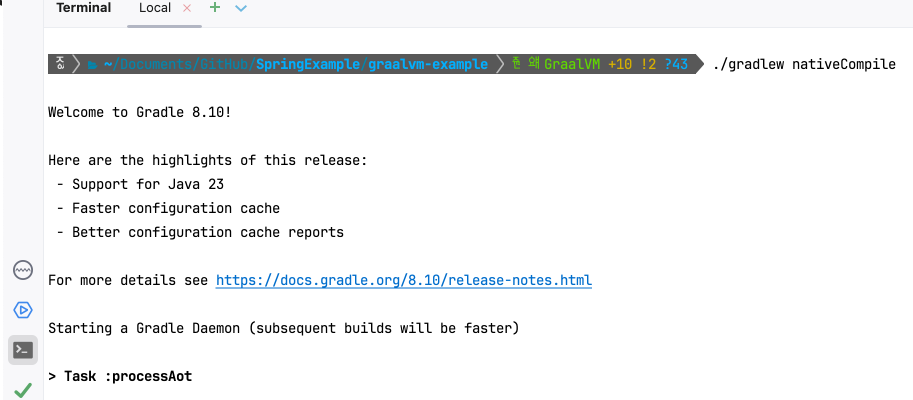


### 빌드 결과물 위치
인텔리제이 스프링부트 프로젝트 기준 `project/build/native/natvieCompile` 에 위치함

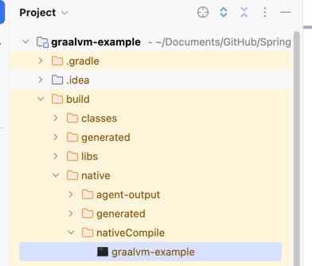


### 실행결과
61ms만에 빈 스프링 프로젝트가 실행된 모습


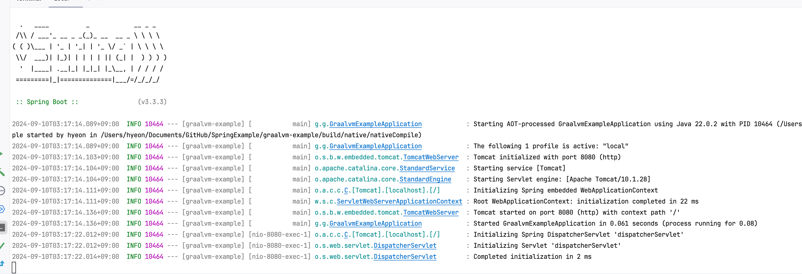

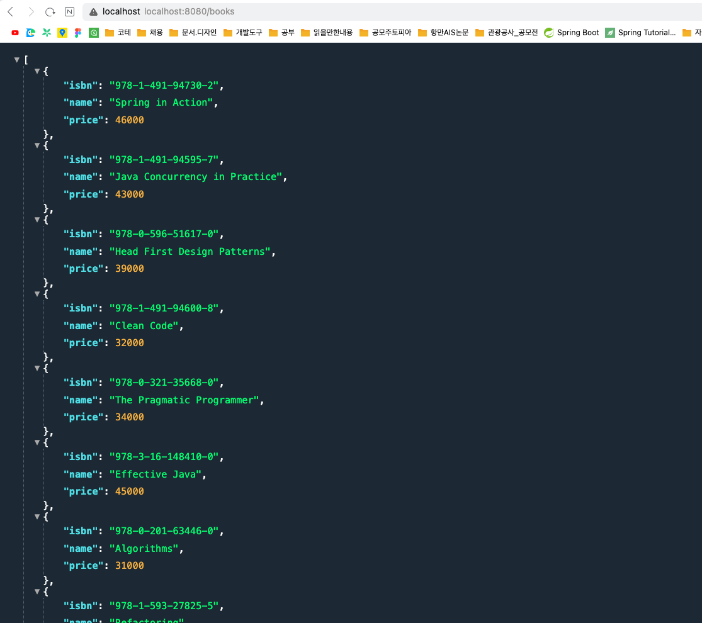

# BootBuildImage

도커 이미지로 만들어봅시다.

`./gradlew bootBuildImage` 명령어를 사용합니다.

### 빌드 성공
14분 걸린거... 이거 맞나요..? ^_^
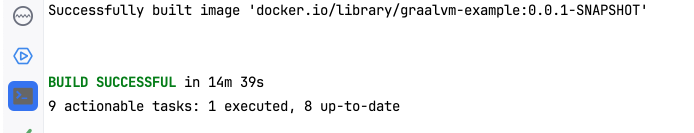

### 도커 이미지로 추가된 모습
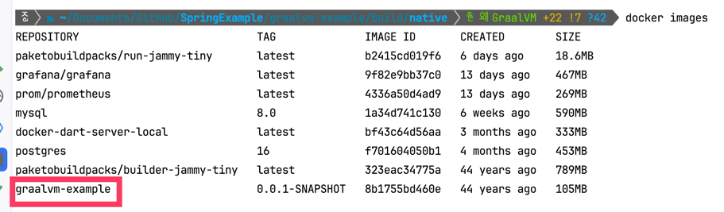

### 실행하기
`docker run -d -p 8080:8080 --name graalvm-example-container graalvm-example:0.0.1-SNAPSHOT`


### AppleSilicon 실행 오류 (Dynamic loader not found: /lib64/ld-linux-x86-64.so.2)
https://github.com/spring-projects/spring-boot/issues/38714

https://github.com/dashaun/paketo-arm64

https://github.com/dashaun/paketo-arm64/issues/19

아래 명령어를 build.gradle에 추가하여 해결 가능
```groovy
bootBuildImage {
    builder = 'paketobuildpacks/builder-jammy-buildpackless-tiny'
    buildpacks = ['paketobuildpacks/java-native-image']
}
```

실행완료 ^_^
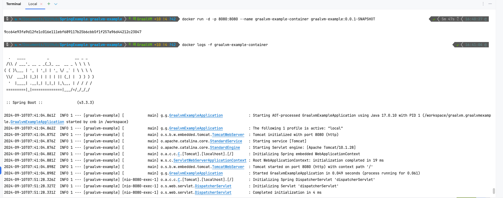

### 다른 해결방법 - orbstack(container) - AppleSilicon 오류
인텔 머신을 추가하고 실행하는 방법도 있다.
`orb update`

`orb createorb create --arch amd64 ubuntu new-ubuntu`

```shell

    ~/Documents/GitHub/SpringExample/graalvm-example/build/native    GraalVM +23 !7 ?42  docker logs -f graalvm-example-container                                                                                                                                                          ✔  03:12:46  
OrbStack ERROR: Dynamic loader not found: /lib64/ld-linux-x86-64.so.2

This usually means that you're running an x86 program on an arm64 OS without multi-arch libraries.
To fix this, you can:
  1. Use an Intel (amd64) container to run this program; or
  2. Install multi-arch libraries in this container.

This can also be caused by running a glibc executable in a musl distro (e.g. Alpine), or vice versa.

For more details and instructions, see https://go.orbstack.dev/multiarch
OrbStack ERROR: Dynamic loader not found: /lib64/ld-linux-x86-64.so.2

This usually means that you're running an x86 program on an arm64 OS without multi-arch libraries.
To fix this, you can:
  1. Use an Intel (amd64) container to run this program; or
  2. Install multi-arch libraries in this container.

This can also be caused by running a glibc executable in a musl distro (e.g. Alpine), or vice versa.

For more details and instructions, see https://go.orbstack.dev/multiarch

```


# Dockerfile
bootBuildImage는 현재 한계가 있다. 바로 멀티플랫폼을 지원하는 명령어가 따로 없다는 것. SpringBoot 3.4에서 관련한 명령어를 지원할 예정이기 때문에 이후 버전을 사용하는 사람은 이걸 사용!

### Dockerfile 작성

```dockerfile
#######################################################################################################################
#
# Build stage
#
#######################################################################################################################
FROM ghcr.io/graalvm/graalvm-ce:ol9-java17-22.3.0 as builder
WORKDIR /app

# Gradle Wrapper 복사
COPY gradlew .
COPY gradle gradle
COPY gradle/ .
RUN chmod +x ./gradlew

# 소스코드 복사
COPY . .

# Install necessary tools
RUN microdnf install -y findutils

# 빌드 진행
RUN ./gradlew nativeCompile


#######################################################################################################################
#
# Runtime stage
#
#######################################################################################################################
FROM oraclelinux:9-slim
WORKDIR /app

# Copy the native executable from the builder stage
COPY --from=builder /app/build/native/nativeCompile/graalvm-example /app/application

# Set the executable permissions
RUN chmod +x /app/application

# Expose the port the app runs on
EXPOSE 8080

# Run the application
CMD ["/app/application"]
```

### build 진행
도커 빌드
```shell
docker build -t springboot-graalvm-docker . --progress=plain 
```

또는 멀티플랫폼을 위한 빌드
```shell
docker buildx build --platform linux/amd64,linux/arm64 -t hyeonbasak/graalvm-example:0.0.2-SNAPSHOT --push .  
```

빌드 성공
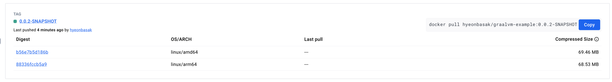

### 실행 성공
- 빌드를 수행한 컴퓨터(arm64)에서 실행 -> OK!
- 다른 아키텍처(amd64)에서 실행 -> OK!

실제 구글 클라우드런(amd64)에서 시작시간을 측정한 결과 약 40ms가 소요되었다. (SpringBoot WEB 기준)

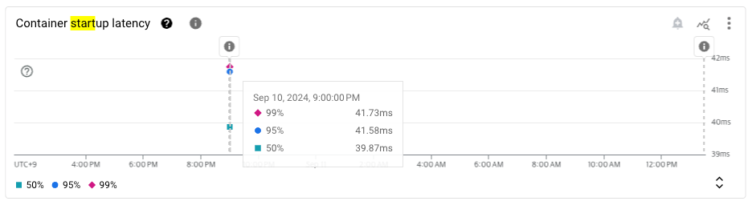

### 의문점. 멀티플랫폼을 지원한다면 빌드되는 nativeImage는 어떤 아키텍처인 것인가?
^_^


<!-- ###################################################################################################################################### -->
<!-- ###################################################################################################################################### -->
<!-- ###################################################################################################################################### -->
<br/>

# NativeBuild시 메모리 부족 문제
의존성이 늘어남에 따라 아래와 같이 메모리 부족으로 빌드가 실패하는 경우가 생겼다.
url: https://stackoverflow.com/questions/77941216/increase-heap-memory-when-building-native-image-with-spring-native

```shell
[1/8] Initializing...                                                                                   (10.7s @ 0.27GB)
 Java version: 17.0.12+8-LTS, vendor version: Oracle GraalVM 17.0.12+8.1
 Graal compiler: optimization level: 2, target machine: armv8-a, PGO: off
 C compiler: cc (apple, arm64, 15.0.0)
 Garbage collector: Serial GC (max heap size: 80% of RAM)
 2 user-specific feature(s)
 - org.eclipse.angus.activation.nativeimage.AngusActivationFeature
 - org.springframework.aot.nativex.feature.PreComputeFieldFeature
SLF4J(W): No SLF4J providers were found.
SLF4J(W): Defaulting to no-operation (NOP) logger implementation
SLF4J(W): See https://www.slf4j.org/codes.html#noProviders for further details.
Terminating due to java.lang.OutOfMemoryError: Java heap space
The Native Image build process ran out of memory.
Please make sure your build system has more memory available.

> Task :nativeCompile FAILED
```
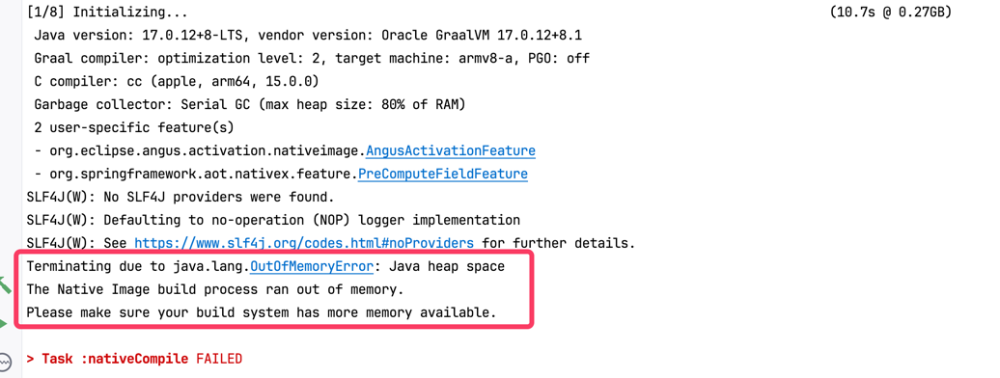


### 해결방법
build시 할당 메모리를 늘려줘봤지만, 직접적인 해결책은 아니었다.
```shell
./gradlew -Dorg.gradle.jvmargs="-Xmx7g -XX:MaxMetaspaceSize=1g" nativeCompile
```

해당 프로젝트 기준, 빌드시 메모리를 약 5GB 정도 사용하므로 이를 감안하여 다른 프로그램들을 꺼두면 좋다. (참고로 저는 인텔리제이를 끄고 터미널로 빌드해서 해결 ㅎㅎ..)
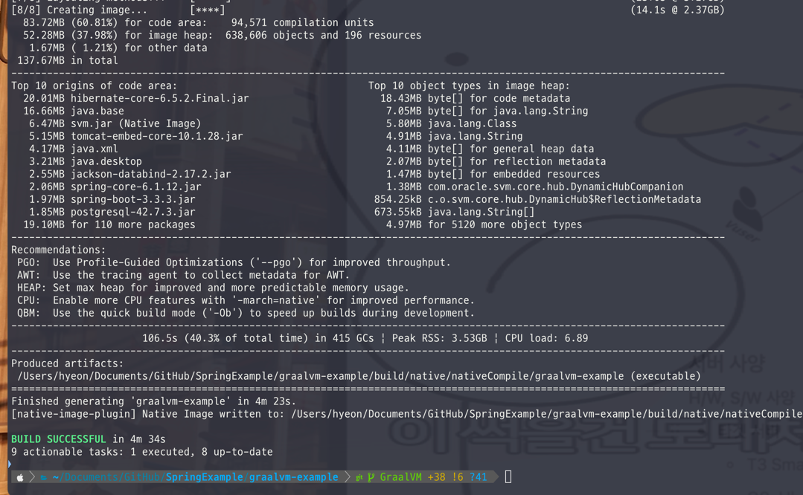

### 실행결과
문제없이 JPA + PostgreSQL 조합의 영속성 데이터를 잘 가져와서 반환해주는 모습

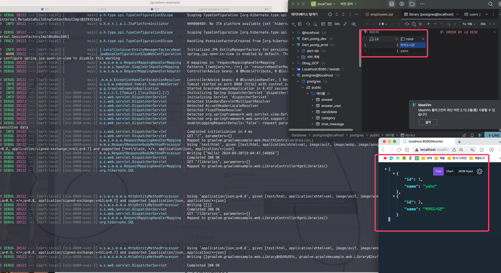


<!-- ###################################################################################################################################### -->
<!-- ###################################################################################################################################### -->
<!-- ###################################################################################################################################### -->
<br/>

# 참고자료

시작하기
https://www.graalvm.org/latest/docs/getting-started/

native-image 명령어도 설치해야함
https://www.graalvm.org/22.0/reference-manual/native-image/

### NoClassDefFoundError
주의점! 예제를 만들때 `package`경로가 들어가지 않도록 주의한다.
Link: https://stackoverflow.com/questions/17973970/how-can-i-solve-java-lang-noclassdeffounderror
```shell
    ~/Doc/GitHub/SpringExample/graalvm-example/src/main/java/graalvm/graalvmexample    GraalVM +11 !4 ?43  native-image HelloWorld                                                                                                                                                         ✔  14:28:10  
========================================================================================================================
GraalVM Native Image: Generating 'helloworld' (executable)...
========================================================================================================================
[1/8] Initializing...                                                                                    (0.0s @ 0.07GB)

The build process encountered an unexpected error:

> java.lang.NoClassDefFoundError: HelloWorld (wrong name: graalvm/graalvmexample/HelloWorld)

Please inspect the generated error report at:
/Users/hyeon/Documents/GitHub/SpringExample/graalvm-example/src/main/java/graalvm/graalvmexample/svm_err_b_20240909T142820.972_pid24795.md

If you are unable to resolve this problem, please file an issue with the error report at:
https://graalvm.org/support
```

- 에러 내용상세: svm_err_b_20240909T142820.972_pid24795.md

### [도커 실행 문제] exec format error
요약하자면 결국 ARM 기반에서 빌드된 이미지를 AMD 기반에서 실행시켰기 때문이다.


`exec /cnb/process/web: exec format error`

https://velog.io/@baeyuna97/exec-user-process-caused-exec-format-error-%EC%97%90%EB%9F%AC%ED%95%B4%EA%B2%B0

https://bconfiden2.github.io/2022/06/29/build-on-mac/

### etc
https://docs.spring.io/spring-boot/reference/packaging/native-image/index.html

https://www.baeldung.com/graal-java-jit-compiler

https://docs.spring.io/spring-boot/reference/packaging/native-image/introducing-graalvm-native-images.html

https://docs.spring.io/spring-boot/how-to/native-image/developing-your-first-application.html

https://docs.orbstack.dev/machines/#intel-x86-emulation

https://medium.com/@dudwls96/multi-architecture-docker-images-%EB%B9%8C%EB%93%9C-%ED%99%98%EA%B2%BD-%EA%B5%AC%EC%84%B1%ED%95%98%EA%B8%B0-421ca3ae380d

SpringBoot 3.4.0 부터는 imagePlatform 옵션이 추가된다.
https://stackoverflow.com/questions/78887383/how-to-build-specific-platform-archetecture-image-with-spring-boot-3-x-bootbuild

Oracle 공식: GraalVM Native Image, Spring and Containerisation
https://luna.oracle.com/lab/fdfd090d-e52c-4481-a8de-dccecdca7d68

Deploying a Spring Boot app as a native GraalVM image with Docker
https://hilla.dev/blog/ai-chatbot-in-java/deploying-a-spring-boot-app-as-a-graalvm-native-image-with-docker/

