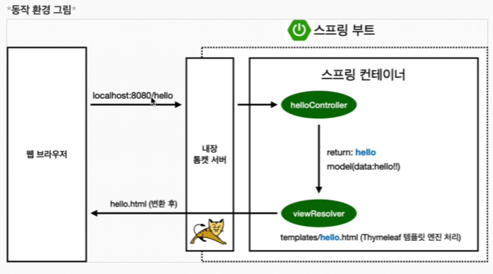
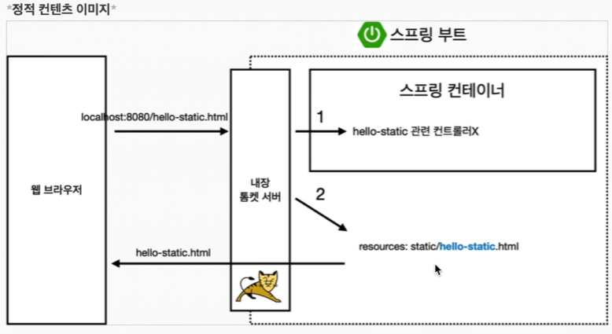
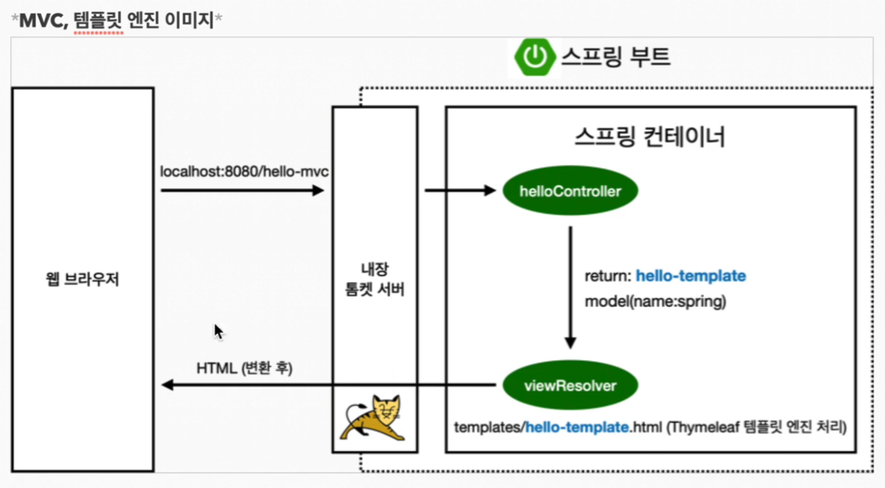
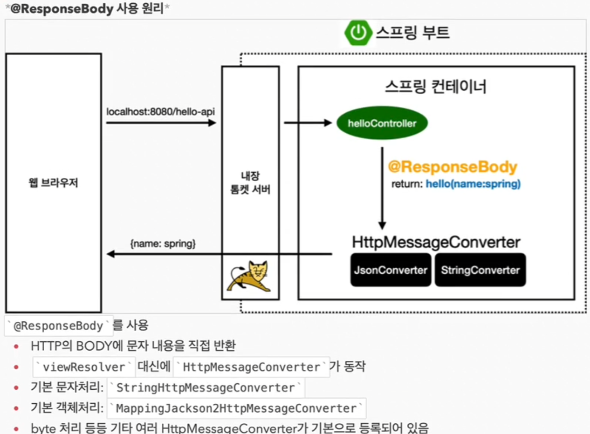

# 프로젝트 환경설정 및 스프링 웹 개발 기초
인프런 강의 기준

## Thymeleaf
### viewResolver
- 스프링 부트 템플릿엔진 기본 viewName 매핑
- resources:templates/ + {ViewName} + .html
- `spring-boot-devtools` 라이브러리를 추가하면 재시작없이 html 수정사항 실시간 반영 가능

## 정적 컨텐츠
- https://docs.spring.io/spring-boot/docs/current/reference/html/web.html#web.servlet.spring-mvc.static-content
- 스프링 부트 정적 컨텐츠 제공 기능
- ex.
  - http://127.0.0.1:8080/hello-static.html 브라우저에서 실행시
  - 스프링 컨테이너에 hello-static 매핑 여부를 확인하고 없으면
  - resources: static/hello-static.html을 찾아서 반환함

## 템플릿 엔진
- 입력값을 넘긴다.

## API 반환 
- ResponseBody 사용시 `viewResolver` 대신 `HttpMessageConverter`를 사용함
- 기본 문자처리시 `StringHttpMessageConverter` 사용
- 기본 객체처리시 `MappingJackson2HttpMessageConverter` 사용
- 또한 여러 포맷에 대해 기본적으로 설정이 되어있음

