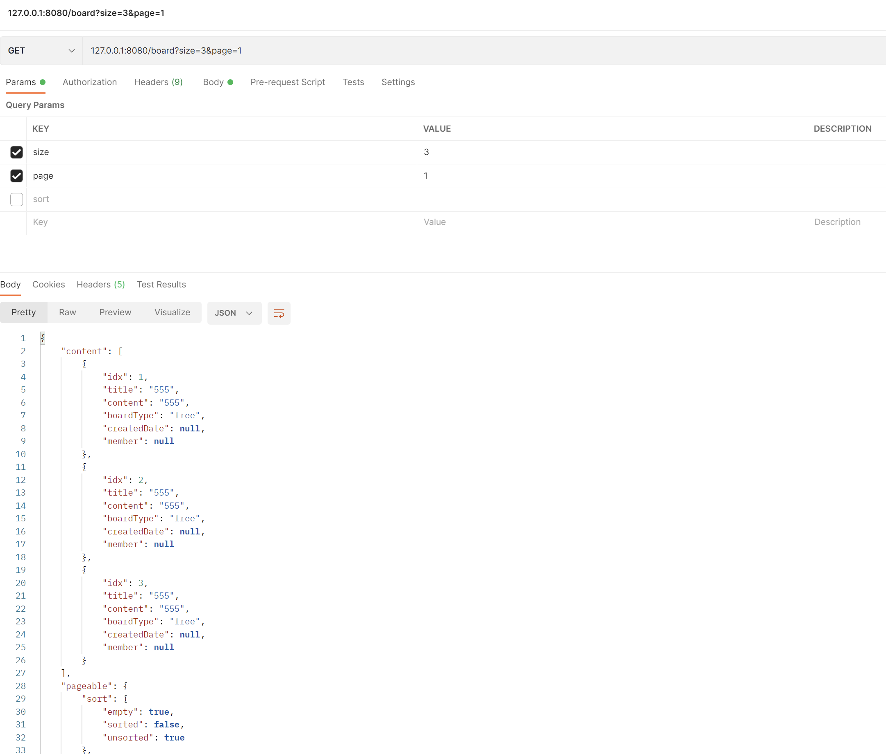
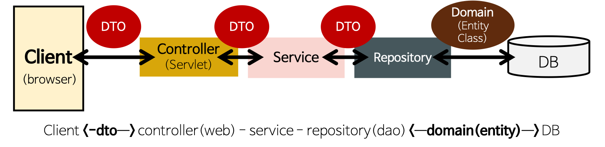

# JPA 사용 예시

## 의존성 dependency
- h2
- jpa

## MVC 프로젝트 (JPA) 구조
Client <-> Controller <-> Service <-> Repository(Entity) <-> DB

### JPA Domain Mapping
Repository <-> JDBC API <-> H2 DB

## 실행결과

 

# 기타

## 관련 내용
### Entity에 serialzable 사용하는 경우는 언제일까
- https://www.inflearn.com/questions/17117

### Test에서 사용하는 assertThat
- https://jsparrow.github.io/rules/replace-j-unit-assert-that-with-hamcrest.html#tags
- https://medium.com/jaehoon-techblog/%EC%9E%90%EB%B0%94%EB%A1%9C-%ED%85%8C%EC%8A%A4%ED%8A%B8-%EC%BD%94%EB%93%9C%EB%A5%BC-%EC%9E%91%EC%84%B1%ED%95%B4%EB%B3%B4%EC%9E%90-2-8c98a883cab7

### Builder에게 책임 전가
- https://cheese10yun.github.io/spring-builder-pattern/

### JPA Update (CURD)
- https://minkukjo.github.io/framework/2020/07/07/Spring-132/
- https://shlee0882.tistory.com/257
- https://dongdd.tistory.com/177

### VO(read only), DTO(전송용), Entity(DB, Domain)
- https://m.blog.naver.com/sgs03091/222067037646
- https://gmlwjd9405.github.io/2018/12/25/difference-dao-dto-entity.html
- 