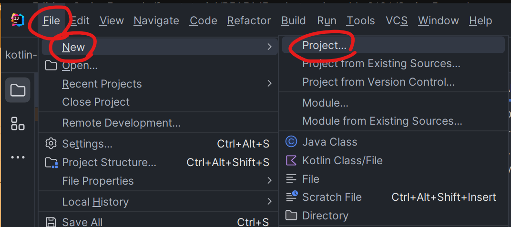

# SpringBoot Kotlin (HelloWorld!)
코틀린을 사용해보지 않은 사람이 참고하기 좋은 간단한 SpringBoot 예제


<br/>

### 테스트 환경
- id("org.springframework.boot") version "3.1.3"
- id("io.spring.dependency-management") version "1.1.3"
- kotlin("jvm") version "1.8.22"
- kotlin("plugin.spring") version "1.8.22"
- JavaVersion.VERSION_17
- Maven 의존성
```kotlin
dependencies {
    implementation("org.springframework.boot:spring-boot-starter-jdbc")
    implementation("org.springframework.boot:spring-boot-starter-data-jdbc")
    implementation("org.springframework.boot:spring-boot-starter-web")
    implementation("com.fasterxml.jackson.module:jackson-module-kotlin")
    implementation("org.jetbrains.kotlin:kotlin-reflect")
    runtimeOnly("com.h2database:h2")
    testImplementation("org.springframework.boot:spring-boot-starter-test")
}
```

<br/>

## 프로젝트 생성
인텔리제이 통해 프로젝트를 생성한다. File > New > Project를 누르고 NewProject 창에서 Spring Initializr를 통해 새 프로젝트를 만들 수 있다. 이 때 언어를 Kotlin에 빌드를 Gradle-Kotlin으로 설정한다.
(왜인지는 모르겠지만 start.spring.io 사이트에 크롬으로 접속하여 만든 프로젝트는 동작을 안했다. 음...)




의존성은 `Spring Web`, `H2`, `JDBC API`, `Spring Data JDBC`를 선택하면 현재 레포와 동일한 의존성으로 구성된다.


<br/>

## 간단히 맛보기

### HelloWorld!
기본적인 구조는 Java SpringBoot와 동일하므로 간단히 `HelloWorld`를 작성해보기에는 어려움이 없을 것이다.
아래는 `HelloController`를 만들고 `method=GET, path=/hello`에 반응하는 메소드를 만든 것이다.
```kotlin
package com.example.kotlinhelloworld

import org.springframework.web.bind.annotation.GetMapping
import org.springframework.web.bind.annotation.RequestMapping
import org.springframework.web.bind.annotation.RequestParam
import org.springframework.web.bind.annotation.RestController

@RestController
@RequestMapping("")
class HelloController {
    @GetMapping("/hello")
    fun hello(@RequestParam("name", required = false, defaultValue = "World") name: String) = "Hello, $name!"
}
```
출력결과
```js
GET http://localhost:8080/hello

HTTP/1.1 200 
Content-Type: text/plain;charset=UTF-8
Content-Length: 13
Date: Sun, 10 Sep 2023 15:07:55 GMT
Keep-Alive: timeout=60
Connection: keep-alive

Hello, World!

Response code: 200; Time: 177ms (177 ms); Content length: 13 bytes (13 B)
```

<br/>

### DTO로 Response주기
일반 평문(String)이 아닌 DTO로 응답을 주기 위해 DataClass를 만든다.
아래는 `Message`라는 DataClass를 만든 모습이다. 
```kotlin
data class Message(val id: String?, val text: String)
```
이제 기존 `HelloController`에 위 DataClass들을 반환하는 메소드를 추가하고 확인해보자
```kotlin
class HelloController {
    // HelloController 내에 아래 구문을 추가합니다.
    @GetMapping("/")
    fun getList():List<Message> {
        return listOf(
            Message("2", "hello"),
            Message("2", "good bye"),
            Message("3", "sure"),
        );
    }
}
```
출력결과
```js
GET http://localhost:8080

HTTP/1.1 200 
Content-Type: application/json
Transfer-Encoding: chunked
Date: Sun, 10 Sep 2023 15:15:34 GMT
Keep-Alive: timeout=60
Connection: keep-alive

[
  {
    "id": "1",
    "text": "hello"
  },
  {
    "id": "2",
    "text": "good bye"
  },
  {
    "id": "3",
    "text": "sure"
  }
]
Response file saved.
> 2023-09-11T001534.200.json

Response code: 200; Time: 120ms (120 ms); Content length: 81 bytes (81 B)
```

<br/>

## MVC 구조 만들기
`Message` 도메인과 관련된 Controller, Service, Repository 그리고 DB(h2) 구조를 만든 예시이다.

### Message: DataClass
어노테이션을 통해 관계정보를 명시하여, CrudRepository를 통해 유연한 제어
```kotlin
package com.example.kotlinhelloworld
import org.springframework.data.annotation.Id
import org.springframework.data.relational.core.mapping.Table

@Table("MESSAGES")
data class Message(@Id var id: String?, val text: String)
```

### schema.sql: sql migration
H2 데이터베이스에 설정할 테이블 정보 쿼리
```sql
CREATE TABLE IF NOT EXISTS messages (
    id       VARCHAR(60)  DEFAULT RANDOM_UUID() PRIMARY KEY,
    text     VARCHAR      NOT NULL
);
```

### application.properties: datasource
DB Connection 생성을 위한 접속 정보
```properties
spring.datasource.driver-class-name=org.h2.Driver
spring.datasource.url=jdbc:h2:file:./data/testdb2
spring.datasource.username=name
spring.datasource.password=password
spring.sql.init.schema-locations=classpath:schema.sql
spring.sql.init.mode=always
```

### MessageController: Controller
Clinet의 Http 요청 맵핑을 위한 Presentation Layer
```kotlin
package com.example.kotlinhelloworld

import org.springframework.web.bind.annotation.*

@RestController
@RequestMapping("/messages")
class MessageController(val messageService:MessageService) {
    @GetMapping("")
    fun getList():List<Message> {
        return messageService.findMessages()
    }

    @GetMapping("/{id}")
    fun get(@PathVariable id: String): List<Message> {
        return messageService.findMessageById(id)
    }

    @PostMapping("")
    fun post(@RequestBody message:Message) {
        messageService.save(message)
    }
}
```

### MessageService: Service
실제 비즈니스 로직이 동작하는 Service Layer
```kotlin
package com.example.kotlinhelloworld

import org.springframework.stereotype.Service
import java.util.*

@Service
class MessageService(val db: MessageRepository) {
    fun findMessages(): List<Message> = db.findAll().toList()

    fun findMessageById(id: String): List<Message> = db.findById(id).toList()

    fun save(message: Message) {
        db.save(message)
    }

    fun <T: Any> Optional<out T>.toList(): List<T> =
        if (isPresent) listOf(get()) else emptyList()
}
```

### MessageRepository: CrudRepository
Data 접근을 담당하는 Repository
```kotlin
package com.example.kotlinhelloworld

import org.springframework.data.repository.CrudRepository

interface MessageRepository : CrudRepository<Message, String>
```

<br/>

## 참고자료
### [kopring tutorial](https://kotlinlang.org/docs/jvm-get-started-spring-boot.html)
Kotlin 공식페이지에 있는 Spring 관련 튜토리얼. 본 레포도 해당글을 기반으로 작성됨


### [language map](https://info.jetbrains.com/kotlin-tips.html?_ga=2.210351445.1731353181.1694336976-231328544.1694336976&_gl=1*1k1hulj*_ga*MjMxMzI4NTQ0LjE2OTQzMzY5NzY.*_ga_9J976DJZ68*MTY5NDMzNjk3Ni4xLjEuMTY5NDMzNzAyMC4wLjAuMA..)
코틀린 학습과 관련된 분류 및 로드맵을 제공함. 각 항목을 클릭하면 공식문서로 링크. 간단한 치트시트로 사용가능

