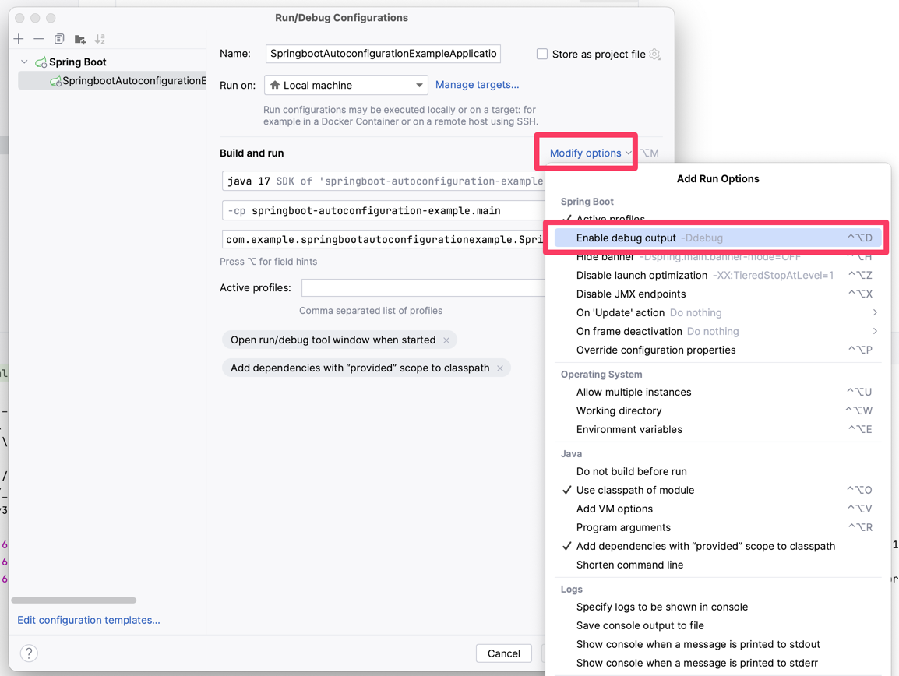

## AutoConfiguration Example
- 자동 구성 컨디션들을 확인하며 추가되는 빈들이 어떤 것이 있는지 확인하여 필요에 따라 커스터마이즈 하는 것이 필요함
- 부트 실행시 VM Option으로 -Ddebug를 주면 더 상세한 동작 정보를 확인할 수 있다.


### 해석
- 각 Bean Method가 있는 클래스에서 @ConditionalOnProperty에서 matchIfMissing=true인 경우 별도로 명시하지 않은 경우 자동으로 matched
- Builder가 Bean으로 등록되어있는 경우가 꽤 많음

## 실제 Console Log
- Positive: 성공적으로 매칭된 Bean Method들
    - Core에 왜 SqlInitAutoConfiguration이 있는가...
- Negative: 매칭되지 못한 Bean Method들

### 필터링 Code
- Ddebug 옵션을 사용하는 경우 Console Log가 너무 길어서 확인하기가 힘들다.
- 관련 내용은 ConditionEvaluationReport 빈으로 존재하기 때문에 이를 이용하는 코드를 작성해 콘솔에 노출될 내용을 직접 설정할 수 있다.
- SpringWeb이 SpringCore만 사용할 때 대비, 50개 정도 더 많은 BeanMethod 매칭을 시도함

SpringCore Only
```json
/Users/hyeon/Library/Java/JavaVirtualMachines/corretto-17.0.4.1/Contents/Home/bin/java -XX:TieredStopAtLevel=1 -Dspring.output.ansi.enabled=always -Dcom.sun.management.jmxremote -Dspring.jmx.enabled=true -Dspring.liveBeansView.mbeanDomain -Dspring.application.admin.enabled=true -Dmanagement.endpoints.jmx.exposure.include=* -javaagent:/Applications/IntelliJ IDEA.app/Contents/lib/idea_rt.jar=55236:/Applications/IntelliJ IDEA.app/Contents/bin -Dfile.encoding=UTF-8 -classpath /Users/hyeon/Documents/GitHub/SpringExample/springboot-autoconfiguration-example/build/classes/java/main:/Users/hyeon/Documents/GitHub/SpringExample/springboot-autoconfiguration-example/build/resources/main:/Users/hyeon/.gradle/caches/modules-2/files-2.1/org.springframework.boot/spring-boot-starter/3.2.0/4d0cc70617a9febbbc6ad81562e930d93f7b2665/spring-boot-starter-3.2.0.jar:/Users/hyeon/.gradle/caches/modules-2/files-2.1/org.springframework.boot/spring-boot-autoconfigure/3.2.0/29b231378146bd6606e75389297f3a7d55476b87/spring-boot-autoconfigure-3.2.0.jar:/Users/hyeon/.gradle/caches/modules-2/files-2.1/org.springframework.boot/spring-boot/3.2.0/4088ad23df91481bc7415cbfa068c423ccb7e54e/spring-boot-3.2.0.jar:/Users/hyeon/.gradle/caches/modules-2/files-2.1/org.springframework.boot/spring-boot-starter-logging/3.2.0/54998ab18f16e8d3a6e46c3d326f2de41c0b1ce0/spring-boot-starter-logging-3.2.0.jar:/Users/hyeon/.gradle/caches/modules-2/files-2.1/jakarta.annotation/jakarta.annotation-api/2.1.1/48b9bda22b091b1f48b13af03fe36db3be6e1ae3/jakarta.annotation-api-2.1.1.jar:/Users/hyeon/.gradle/caches/modules-2/files-2.1/org.springframework/spring-core/6.1.1/22d73bef97aff8a74a992716fe1aafc8f8a8a68d/spring-core-6.1.1.jar:/Users/hyeon/.gradle/caches/modules-2/files-2.1/org.yaml/snakeyaml/2.2/3af797a25458550a16bf89acc8e4ab2b7f2bfce0/snakeyaml-2.2.jar:/Users/hyeon/.gradle/caches/modules-2/files-2.1/org.springframework/spring-context/6.1.1/610d7dd3f62d22d42b993a201e3110649b68e17/spring-context-6.1.1.jar:/Users/hyeon/.gradle/caches/modules-2/files-2.1/ch.qos.logback/logback-classic/1.4.11/54450c0c783e896a1a6d88c043bd2f1daba1c382/logback-classic-1.4.11.jar:/Users/hyeon/.gradle/caches/modules-2/files-2.1/org.apache.logging.log4j/log4j-to-slf4j/2.21.1/d77b2ba81711ed596cd797cc2b5b5bd7409d841c/log4j-to-slf4j-2.21.1.jar:/Users/hyeon/.gradle/caches/modules-2/files-2.1/org.slf4j/jul-to-slf4j/2.0.9/9ef7c70b248185845f013f49a33ff9ca65b7975/jul-to-slf4j-2.0.9.jar:/Users/hyeon/.gradle/caches/modules-2/files-2.1/org.springframework/spring-jcl/6.1.1/69ebbf7bad707d34e81d00213c756bc6fcc31dd7/spring-jcl-6.1.1.jar:/Users/hyeon/.gradle/caches/modules-2/files-2.1/org.springframework/spring-aop/6.1.1/66cb0e08770d4523ae3976b0b791cde767466c61/spring-aop-6.1.1.jar:/Users/hyeon/.gradle/caches/modules-2/files-2.1/org.springframework/spring-beans/6.1.1/6af88af13193acf2197bc0a42f0ec4e5c481bfe9/spring-beans-6.1.1.jar:/Users/hyeon/.gradle/caches/modules-2/files-2.1/org.springframework/spring-expression/6.1.1/807700a64cb055ed85af189d1fa0702bc0d2efba/spring-expression-6.1.1.jar:/Users/hyeon/.gradle/caches/modules-2/files-2.1/io.micrometer/micrometer-observation/1.12.0/4f4981faa7968441d0092107df9b750e057374af/micrometer-observation-1.12.0.jar:/Users/hyeon/.gradle/caches/modules-2/files-2.1/ch.qos.logback/logback-core/1.4.11/2f9f280219a9922a74200eaf7138c4c17fb87c0f/logback-core-1.4.11.jar:/Users/hyeon/.gradle/caches/modules-2/files-2.1/org.slf4j/slf4j-api/2.0.9/7cf2726fdcfbc8610f9a71fb3ed639871f315340/slf4j-api-2.0.9.jar:/Users/hyeon/.gradle/caches/modules-2/files-2.1/org.apache.logging.log4j/log4j-api/2.21.1/74c65e87b9ce1694a01524e192d7be989ba70486/log4j-api-2.21.1.jar:/Users/hyeon/.gradle/caches/modules-2/files-2.1/io.micrometer/micrometer-commons/1.12.0/2436654d439bd4ff6aad6419519357be8ba4f0d/micrometer-commons-1.12.0.jar com.example.springbootautoconfigurationexample.SpringbootAutoconfigurationExampleApplication

  .   ____          _            __ _ _
 /\\ / ___'_ __ _ _(_)_ __  __ _ \ \ \ \
( ( )\___ | '_ | '_| | '_ \/ _` | \ \ \ \
 \\/  ___)| |_)| | | | | || (_| |  ) ) ) )
  '  |____| .__|_| |_|_| |_\__, | / / / /
 =========|_|==============|___/=/_/_/_/
 :: Spring Boot ::                (v3.2.0)

2023-12-09T20:32:23.711+09:00  INFO 6561 --- [           main] gbootAutoconfigurationExampleApplication : Starting SpringbootAutoconfigurationExampleApplication using Java 17.0.4.1 with PID 6561 (/Users/hyeon/Documents/GitHub/SpringExample/springboot-autoconfiguration-example/build/classes/java/main started by hyeon in /Users/hyeon/Documents/GitHub/SpringExample/springboot-autoconfiguration-example)
2023-12-09T20:32:23.713+09:00  INFO 6561 --- [           main] gbootAutoconfigurationExampleApplication : The following 1 profile is active: "local"
2023-12-09T20:32:23.892+09:00  INFO 6561 --- [           main] gbootAutoconfigurationExampleApplication : Started SpringbootAutoconfigurationExampleApplication in 0.287 seconds (process running for 0.467)
org.springframework.boot.autoconfigure.admin.SpringApplicationAdminJmxAutoConfiguration
	@ConditionalOnProperty (spring.application.admin.enabled=true) matched

org.springframework.boot.autoconfigure.admin.SpringApplicationAdminJmxAutoConfiguration#springApplicationAdminRegistrar
	@ConditionalOnMissingBean (types: org.springframework.boot.admin.SpringApplicationAdminMXBeanRegistrar; SearchStrategy: all) did not find any beans

org.springframework.boot.autoconfigure.aop.AopAutoConfiguration
	@ConditionalOnProperty (spring.aop.auto=true) matched

org.springframework.boot.autoconfigure.aop.AopAutoConfiguration$ClassProxyingConfiguration
	@ConditionalOnMissingClass did not find unwanted class 'org.aspectj.weaver.Advice'
	@ConditionalOnProperty (spring.aop.proxy-target-class=true) matched

org.springframework.boot.autoconfigure.availability.ApplicationAvailabilityAutoConfiguration#applicationAvailability
	@ConditionalOnMissingBean (types: org.springframework.boot.availability.ApplicationAvailability; SearchStrategy: all) did not find any beans

org.springframework.boot.autoconfigure.cache.GenericCacheConfiguration
	Cache org.springframework.boot.autoconfigure.cache.GenericCacheConfiguration automatic cache type

org.springframework.boot.autoconfigure.cache.NoOpCacheConfiguration
	Cache org.springframework.boot.autoconfigure.cache.NoOpCacheConfiguration automatic cache type

org.springframework.boot.autoconfigure.cache.SimpleCacheConfiguration
	Cache org.springframework.boot.autoconfigure.cache.SimpleCacheConfiguration automatic cache type

org.springframework.boot.autoconfigure.context.LifecycleAutoConfiguration#defaultLifecycleProcessor
	@ConditionalOnMissingBean (names: lifecycleProcessor; SearchStrategy: current) did not find any beans

org.springframework.boot.autoconfigure.context.PropertyPlaceholderAutoConfiguration#propertySourcesPlaceholderConfigurer
	@ConditionalOnMissingBean (types: org.springframework.context.support.PropertySourcesPlaceholderConfigurer; SearchStrategy: current) did not find any beans

org.springframework.boot.autoconfigure.jmx.JmxAutoConfiguration
	@ConditionalOnClass found required class 'org.springframework.jmx.export.MBeanExporter'
	@ConditionalOnProperty (spring.jmx.enabled=true) matched

org.springframework.boot.autoconfigure.jmx.JmxAutoConfiguration#mbeanExporter
	@ConditionalOnMissingBean (types: org.springframework.jmx.export.MBeanExporter; SearchStrategy: current) did not find any beans

org.springframework.boot.autoconfigure.jmx.JmxAutoConfiguration#mbeanServer
	@ConditionalOnMissingBean (types: javax.management.MBeanServer; SearchStrategy: all) did not find any beans

org.springframework.boot.autoconfigure.jmx.JmxAutoConfiguration#objectNamingStrategy
	@ConditionalOnMissingBean (types: org.springframework.jmx.export.naming.ObjectNamingStrategy; SearchStrategy: current) did not find any beans

org.springframework.boot.autoconfigure.sql.init.SqlInitializationAutoConfiguration
	@ConditionalOnProperty (spring.sql.init.enabled) matched
	NoneNestedConditions 0 matched 1 did not; NestedCondition on SqlInitializationAutoConfiguration.SqlInitializationModeCondition.ModeIsNever @ConditionalOnProperty (spring.sql.init.mode=never) did not find property 'mode'

org.springframework.boot.autoconfigure.ssl.SslAutoConfiguration#sslBundleRegistry
	@ConditionalOnMissingBean (types: org.springframework.boot.ssl.SslBundleRegistry,org.springframework.boot.ssl.SslBundles; SearchStrategy: all) did not find any beans

org.springframework.boot.autoconfigure.task.TaskExecutionAutoConfiguration
	@ConditionalOnClass found required class 'org.springframework.scheduling.concurrent.ThreadPoolTaskExecutor'

org.springframework.boot.autoconfigure.task.TaskExecutorConfigurations$SimpleAsyncTaskExecutorBuilderConfiguration#simpleAsyncTaskExecutorBuilder
	@ConditionalOnMissingBean (types: org.springframework.boot.task.SimpleAsyncTaskExecutorBuilder; SearchStrategy: all) did not find any beans
	@ConditionalOnThreading found PLATFORM

org.springframework.boot.autoconfigure.task.TaskExecutorConfigurations$TaskExecutorBuilderConfiguration#taskExecutorBuilder
	@ConditionalOnMissingBean (types: org.springframework.boot.task.TaskExecutorBuilder; SearchStrategy: all) did not find any beans

org.springframework.boot.autoconfigure.task.TaskExecutorConfigurations$TaskExecutorConfiguration
	@ConditionalOnMissingBean (types: java.util.concurrent.Executor; SearchStrategy: all) did not find any beans

org.springframework.boot.autoconfigure.task.TaskExecutorConfigurations$TaskExecutorConfiguration#applicationTaskExecutor
	@ConditionalOnThreading found PLATFORM

org.springframework.boot.autoconfigure.task.TaskExecutorConfigurations$ThreadPoolTaskExecutorBuilderConfiguration#threadPoolTaskExecutorBuilder
	@ConditionalOnMissingBean (types: org.springframework.boot.task.TaskExecutorBuilder,org.springframework.boot.task.ThreadPoolTaskExecutorBuilder; SearchStrategy: all) did not find any beans

org.springframework.boot.autoconfigure.task.TaskSchedulingAutoConfiguration
	@ConditionalOnClass found required class 'org.springframework.scheduling.concurrent.ThreadPoolTaskScheduler'

org.springframework.boot.autoconfigure.task.TaskSchedulingConfigurations$SimpleAsyncTaskSchedulerBuilderConfiguration#simpleAsyncTaskSchedulerBuilder
	@ConditionalOnMissingBean (types: org.springframework.boot.task.SimpleAsyncTaskSchedulerBuilder; SearchStrategy: all) did not find any beans
	@ConditionalOnThreading found PLATFORM

org.springframework.boot.autoconfigure.task.TaskSchedulingConfigurations$TaskSchedulerBuilderConfiguration#taskSchedulerBuilder
	@ConditionalOnMissingBean (types: org.springframework.boot.task.TaskSchedulerBuilder; SearchStrategy: all) did not find any beans

org.springframework.boot.autoconfigure.task.TaskSchedulingConfigurations$ThreadPoolTaskSchedulerBuilderConfiguration#threadPoolTaskSchedulerBuilder
	@ConditionalOnMissingBean (types: org.springframework.boot.task.TaskSchedulerBuilder,org.springframework.boot.task.ThreadPoolTaskSchedulerBuilder; SearchStrategy: all) did not find any beans

Bean갯수: 26

Process finished with exit code 0

```

SpringWebStarter
```json
/Users/hyeon/Library/Java/JavaVirtualMachines/corretto-17.0.4.1/Contents/Home/bin/java -XX:TieredStopAtLevel=1 -Dspring.output.ansi.enabled=always -Dcom.sun.management.jmxremote -Dspring.jmx.enabled=true -Dspring.liveBeansView.mbeanDomain -Dspring.application.admin.enabled=true -Dmanagement.endpoints.jmx.exposure.include=* -javaagent:/Applications/IntelliJ IDEA.app/Contents/lib/idea_rt.jar=55592:/Applications/IntelliJ IDEA.app/Contents/bin -Dfile.encoding=UTF-8 -classpath /Users/hyeon/Documents/GitHub/SpringExample/springboot-autoconfiguration-example/build/classes/java/main:/Users/hyeon/Documents/GitHub/SpringExample/springboot-autoconfiguration-example/build/resources/main:/Users/hyeon/.gradle/caches/modules-2/files-2.1/org.springframework.boot/spring-boot-starter-web/3.2.0/e609f839e7c2ff9c90bc75d7c05dbcbb19315319/spring-boot-starter-web-3.2.0.jar:/Users/hyeon/.gradle/caches/modules-2/files-2.1/org.springframework.boot/spring-boot-starter-json/3.2.0/e831483c03433b987cc9c72f8ea67757f9865191/spring-boot-starter-json-3.2.0.jar:/Users/hyeon/.gradle/caches/modules-2/files-2.1/org.springframework.boot/spring-boot-starter/3.2.0/4d0cc70617a9febbbc6ad81562e930d93f7b2665/spring-boot-starter-3.2.0.jar:/Users/hyeon/.gradle/caches/modules-2/files-2.1/org.springframework.boot/spring-boot-starter-tomcat/3.2.0/fc758099e394fe5646d9e36883fab38da4b26e22/spring-boot-starter-tomcat-3.2.0.jar:/Users/hyeon/.gradle/caches/modules-2/files-2.1/org.springframework/spring-webmvc/6.1.1/76c4408b67828aa9656f5955dc2c1c4c0e1b6da3/spring-webmvc-6.1.1.jar:/Users/hyeon/.gradle/caches/modules-2/files-2.1/org.springframework/spring-web/6.1.1/4eeb5f2edb9f04d00357edcc56b59d3874b3b453/spring-web-6.1.1.jar:/Users/hyeon/.gradle/caches/modules-2/files-2.1/com.fasterxml.jackson.datatype/jackson-datatype-jsr310/2.15.3/4a20a0e104931bfa72f24ef358c2eb63f1ef2aaf/jackson-datatype-jsr310-2.15.3.jar:/Users/hyeon/.gradle/caches/modules-2/files-2.1/com.fasterxml.jackson.module/jackson-module-parameter-names/2.15.3/8d251b90c5358677e7d8161e0c2488e6f84f49da/jackson-module-parameter-names-2.15.3.jar:/Users/hyeon/.gradle/caches/modules-2/files-2.1/com.fasterxml.jackson.datatype/jackson-datatype-jdk8/2.15.3/80158cb020c7bd4e4ba94d8d752a65729dc943b2/jackson-datatype-jdk8-2.15.3.jar:/Users/hyeon/.gradle/caches/modules-2/files-2.1/com.fasterxml.jackson.core/jackson-databind/2.15.3/a734bc2c47a9453c4efa772461a3aeb273c010d9/jackson-databind-2.15.3.jar:/Users/hyeon/.gradle/caches/modules-2/files-2.1/org.springframework.boot/spring-boot-autoconfigure/3.2.0/29b231378146bd6606e75389297f3a7d55476b87/spring-boot-autoconfigure-3.2.0.jar:/Users/hyeon/.gradle/caches/modules-2/files-2.1/org.springframework.boot/spring-boot/3.2.0/4088ad23df91481bc7415cbfa068c423ccb7e54e/spring-boot-3.2.0.jar:/Users/hyeon/.gradle/caches/modules-2/files-2.1/org.springframework.boot/spring-boot-starter-logging/3.2.0/54998ab18f16e8d3a6e46c3d326f2de41c0b1ce0/spring-boot-starter-logging-3.2.0.jar:/Users/hyeon/.gradle/caches/modules-2/files-2.1/jakarta.annotation/jakarta.annotation-api/2.1.1/48b9bda22b091b1f48b13af03fe36db3be6e1ae3/jakarta.annotation-api-2.1.1.jar:/Users/hyeon/.gradle/caches/modules-2/files-2.1/org.springframework/spring-core/6.1.1/22d73bef97aff8a74a992716fe1aafc8f8a8a68d/spring-core-6.1.1.jar:/Users/hyeon/.gradle/caches/modules-2/files-2.1/org.yaml/snakeyaml/2.2/3af797a25458550a16bf89acc8e4ab2b7f2bfce0/snakeyaml-2.2.jar:/Users/hyeon/.gradle/caches/modules-2/files-2.1/org.apache.tomcat.embed/tomcat-embed-websocket/10.1.16/5c372739ee9409b47c474d8d47d276a7cd9bc2b/tomcat-embed-websocket-10.1.16.jar:/Users/hyeon/.gradle/caches/modules-2/files-2.1/org.apache.tomcat.embed/tomcat-embed-core/10.1.16/176162fb3998856a90436826034ffe5d25beaeb9/tomcat-embed-core-10.1.16.jar:/Users/hyeon/.gradle/caches/modules-2/files-2.1/org.apache.tomcat.embed/tomcat-embed-el/10.1.16/f057e54bfffe99df7f0d04cd4e688e55bf8a0da5/tomcat-embed-el-10.1.16.jar:/Users/hyeon/.gradle/caches/modules-2/files-2.1/org.springframework/spring-context/6.1.1/610d7dd3f62d22d42b993a201e3110649b68e17/spring-context-6.1.1.jar:/Users/hyeon/.gradle/caches/modules-2/files-2.1/org.springframework/spring-aop/6.1.1/66cb0e08770d4523ae3976b0b791cde767466c61/spring-aop-6.1.1.jar:/Users/hyeon/.gradle/caches/modules-2/files-2.1/org.springframework/spring-beans/6.1.1/6af88af13193acf2197bc0a42f0ec4e5c481bfe9/spring-beans-6.1.1.jar:/Users/hyeon/.gradle/caches/modules-2/files-2.1/org.springframework/spring-expression/6.1.1/807700a64cb055ed85af189d1fa0702bc0d2efba/spring-expression-6.1.1.jar:/Users/hyeon/.gradle/caches/modules-2/files-2.1/io.micrometer/micrometer-observation/1.12.0/4f4981faa7968441d0092107df9b750e057374af/micrometer-observation-1.12.0.jar:/Users/hyeon/.gradle/caches/modules-2/files-2.1/com.fasterxml.jackson.core/jackson-annotations/2.15.3/79baf4e605eb3bbb60b1c475d44a7aecceea1d60/jackson-annotations-2.15.3.jar:/Users/hyeon/.gradle/caches/modules-2/files-2.1/com.fasterxml.jackson.core/jackson-core/2.15.3/60d600567c1862840397bf9ff5a92398edc5797b/jackson-core-2.15.3.jar:/Users/hyeon/.gradle/caches/modules-2/files-2.1/ch.qos.logback/logback-classic/1.4.11/54450c0c783e896a1a6d88c043bd2f1daba1c382/logback-classic-1.4.11.jar:/Users/hyeon/.gradle/caches/modules-2/files-2.1/org.apache.logging.log4j/log4j-to-slf4j/2.21.1/d77b2ba81711ed596cd797cc2b5b5bd7409d841c/log4j-to-slf4j-2.21.1.jar:/Users/hyeon/.gradle/caches/modules-2/files-2.1/org.slf4j/jul-to-slf4j/2.0.9/9ef7c70b248185845f013f49a33ff9ca65b7975/jul-to-slf4j-2.0.9.jar:/Users/hyeon/.gradle/caches/modules-2/files-2.1/org.springframework/spring-jcl/6.1.1/69ebbf7bad707d34e81d00213c756bc6fcc31dd7/spring-jcl-6.1.1.jar:/Users/hyeon/.gradle/caches/modules-2/files-2.1/io.micrometer/micrometer-commons/1.12.0/2436654d439bd4ff6aad6419519357be8ba4f0d/micrometer-commons-1.12.0.jar:/Users/hyeon/.gradle/caches/modules-2/files-2.1/ch.qos.logback/logback-core/1.4.11/2f9f280219a9922a74200eaf7138c4c17fb87c0f/logback-core-1.4.11.jar:/Users/hyeon/.gradle/caches/modules-2/files-2.1/org.slf4j/slf4j-api/2.0.9/7cf2726fdcfbc8610f9a71fb3ed639871f315340/slf4j-api-2.0.9.jar:/Users/hyeon/.gradle/caches/modules-2/files-2.1/org.apache.logging.log4j/log4j-api/2.21.1/74c65e87b9ce1694a01524e192d7be989ba70486/log4j-api-2.21.1.jar com.example.springbootautoconfigurationexample.SpringbootAutoconfigurationExampleApplication

  .   ____          _            __ _ _
 /\\ / ___'_ __ _ _(_)_ __  __ _ \ \ \ \
( ( )\___ | '_ | '_| | '_ \/ _` | \ \ \ \
 \\/  ___)| |_)| | | | | || (_| |  ) ) ) )
  '  |____| .__|_| |_|_| |_\__, | / / / /
 =========|_|==============|___/=/_/_/_/
 :: Spring Boot ::                (v3.2.0)

2023-12-09T21:55:09.681+09:00  INFO 7343 --- [           main] gbootAutoconfigurationExampleApplication : Starting SpringbootAutoconfigurationExampleApplication using Java 17.0.4.1 with PID 7343 (/Users/hyeon/Documents/GitHub/SpringExample/springboot-autoconfiguration-example/build/classes/java/main started by hyeon in /Users/hyeon/Documents/GitHub/SpringExample/springboot-autoconfiguration-example)
2023-12-09T21:55:09.682+09:00  INFO 7343 --- [           main] gbootAutoconfigurationExampleApplication : The following 1 profile is active: "local"
2023-12-09T21:55:09.976+09:00  INFO 7343 --- [           main] o.s.b.w.embedded.tomcat.TomcatWebServer  : Tomcat initialized with port 8080 (http)
2023-12-09T21:55:09.980+09:00  INFO 7343 --- [           main] o.apache.catalina.core.StandardService   : Starting service [Tomcat]
2023-12-09T21:55:09.980+09:00  INFO 7343 --- [           main] o.apache.catalina.core.StandardEngine    : Starting Servlet engine: [Apache Tomcat/10.1.16]
2023-12-09T21:55:09.996+09:00  INFO 7343 --- [           main] o.a.c.c.C.[Tomcat].[localhost].[/]       : Initializing Spring embedded WebApplicationContext
2023-12-09T21:55:09.996+09:00  INFO 7343 --- [           main] w.s.c.ServletWebServerApplicationContext : Root WebApplicationContext: initialization completed in 298 ms
2023-12-09T21:55:10.109+09:00  INFO 7343 --- [           main] o.s.b.w.embedded.tomcat.TomcatWebServer  : Tomcat started on port 8080 (http) with context path ''
2023-12-09T21:55:10.113+09:00  INFO 7343 --- [           main] gbootAutoconfigurationExampleApplication : Started SpringbootAutoconfigurationExampleApplication in 0.557 seconds (process running for 0.801)
org.springframework.boot.autoconfigure.admin.SpringApplicationAdminJmxAutoConfiguration
	@ConditionalOnProperty (spring.application.admin.enabled=true) matched

org.springframework.boot.autoconfigure.admin.SpringApplicationAdminJmxAutoConfiguration#springApplicationAdminRegistrar
	@ConditionalOnMissingBean (types: org.springframework.boot.admin.SpringApplicationAdminMXBeanRegistrar; SearchStrategy: all) did not find any beans

org.springframework.boot.autoconfigure.aop.AopAutoConfiguration
	@ConditionalOnProperty (spring.aop.auto=true) matched

org.springframework.boot.autoconfigure.aop.AopAutoConfiguration$ClassProxyingConfiguration
	@ConditionalOnMissingClass did not find unwanted class 'org.aspectj.weaver.Advice'
	@ConditionalOnProperty (spring.aop.proxy-target-class=true) matched

org.springframework.boot.autoconfigure.availability.ApplicationAvailabilityAutoConfiguration#applicationAvailability
	@ConditionalOnMissingBean (types: org.springframework.boot.availability.ApplicationAvailability; SearchStrategy: all) did not find any beans

org.springframework.boot.autoconfigure.cache.GenericCacheConfiguration
	Cache org.springframework.boot.autoconfigure.cache.GenericCacheConfiguration automatic cache type

org.springframework.boot.autoconfigure.cache.NoOpCacheConfiguration
	Cache org.springframework.boot.autoconfigure.cache.NoOpCacheConfiguration automatic cache type

org.springframework.boot.autoconfigure.cache.SimpleCacheConfiguration
	Cache org.springframework.boot.autoconfigure.cache.SimpleCacheConfiguration automatic cache type

org.springframework.boot.autoconfigure.context.LifecycleAutoConfiguration#defaultLifecycleProcessor
	@ConditionalOnMissingBean (names: lifecycleProcessor; SearchStrategy: current) did not find any beans

org.springframework.boot.autoconfigure.context.PropertyPlaceholderAutoConfiguration#propertySourcesPlaceholderConfigurer
	@ConditionalOnMissingBean (types: org.springframework.context.support.PropertySourcesPlaceholderConfigurer; SearchStrategy: current) did not find any beans

org.springframework.boot.autoconfigure.http.HttpMessageConvertersAutoConfiguration
	@ConditionalOnClass found required class 'org.springframework.http.converter.HttpMessageConverter'
	NoneNestedConditions 0 matched 1 did not; NestedCondition on HttpMessageConvertersAutoConfiguration.NotReactiveWebApplicationCondition.ReactiveWebApplication did not find reactive web application classes

org.springframework.boot.autoconfigure.http.HttpMessageConvertersAutoConfiguration#messageConverters
	@ConditionalOnMissingBean (types: org.springframework.boot.autoconfigure.http.HttpMessageConverters; SearchStrategy: all) did not find any beans

org.springframework.boot.autoconfigure.http.HttpMessageConvertersAutoConfiguration$StringHttpMessageConverterConfiguration
	@ConditionalOnClass found required class 'org.springframework.http.converter.StringHttpMessageConverter'

org.springframework.boot.autoconfigure.http.HttpMessageConvertersAutoConfiguration$StringHttpMessageConverterConfiguration#stringHttpMessageConverter
	@ConditionalOnMissingBean (types: org.springframework.http.converter.StringHttpMessageConverter; SearchStrategy: all) did not find any beans

org.springframework.boot.autoconfigure.http.JacksonHttpMessageConvertersConfiguration$MappingJackson2HttpMessageConverterConfiguration
	@ConditionalOnClass found required class 'com.fasterxml.jackson.databind.ObjectMapper'
	@ConditionalOnProperty (spring.mvc.converters.preferred-json-mapper=jackson) matched
	@ConditionalOnBean (types: com.fasterxml.jackson.databind.ObjectMapper; SearchStrategy: all) found bean 'jacksonObjectMapper'

org.springframework.boot.autoconfigure.http.JacksonHttpMessageConvertersConfiguration$MappingJackson2HttpMessageConverterConfiguration#mappingJackson2HttpMessageConverter
	@ConditionalOnMissingBean (types: org.springframework.http.converter.json.MappingJackson2HttpMessageConverter ignored: org.springframework.hateoas.server.mvc.TypeConstrainedMappingJackson2HttpMessageConverter,org.springframework.data.rest.webmvc.alps.AlpsJsonHttpMessageConverter; SearchStrategy: all) did not find any beans

org.springframework.boot.autoconfigure.jackson.JacksonAutoConfiguration
	@ConditionalOnClass found required class 'com.fasterxml.jackson.databind.ObjectMapper'

org.springframework.boot.autoconfigure.jackson.JacksonAutoConfiguration$Jackson2ObjectMapperBuilderCustomizerConfiguration
	@ConditionalOnClass found required class 'org.springframework.http.converter.json.Jackson2ObjectMapperBuilder'

org.springframework.boot.autoconfigure.jackson.JacksonAutoConfiguration$JacksonObjectMapperBuilderConfiguration
	@ConditionalOnClass found required class 'org.springframework.http.converter.json.Jackson2ObjectMapperBuilder'

org.springframework.boot.autoconfigure.jackson.JacksonAutoConfiguration$JacksonObjectMapperBuilderConfiguration#jacksonObjectMapperBuilder
	@ConditionalOnMissingBean (types: org.springframework.http.converter.json.Jackson2ObjectMapperBuilder; SearchStrategy: all) did not find any beans

org.springframework.boot.autoconfigure.jackson.JacksonAutoConfiguration$JacksonObjectMapperConfiguration
	@ConditionalOnClass found required class 'org.springframework.http.converter.json.Jackson2ObjectMapperBuilder'

org.springframework.boot.autoconfigure.jackson.JacksonAutoConfiguration$JacksonObjectMapperConfiguration#jacksonObjectMapper
	@ConditionalOnMissingBean (types: com.fasterxml.jackson.databind.ObjectMapper; SearchStrategy: all) did not find any beans

org.springframework.boot.autoconfigure.jackson.JacksonAutoConfiguration$ParameterNamesModuleConfiguration
	@ConditionalOnClass found required class 'com.fasterxml.jackson.module.paramnames.ParameterNamesModule'

org.springframework.boot.autoconfigure.jackson.JacksonAutoConfiguration$ParameterNamesModuleConfiguration#parameterNamesModule
	@ConditionalOnMissingBean (types: com.fasterxml.jackson.module.paramnames.ParameterNamesModule; SearchStrategy: all) did not find any beans

org.springframework.boot.autoconfigure.jmx.JmxAutoConfiguration
	@ConditionalOnClass found required class 'org.springframework.jmx.export.MBeanExporter'
	@ConditionalOnProperty (spring.jmx.enabled=true) matched

org.springframework.boot.autoconfigure.jmx.JmxAutoConfiguration#mbeanExporter
	@ConditionalOnMissingBean (types: org.springframework.jmx.export.MBeanExporter; SearchStrategy: current) did not find any beans

org.springframework.boot.autoconfigure.jmx.JmxAutoConfiguration#mbeanServer
	@ConditionalOnMissingBean (types: javax.management.MBeanServer; SearchStrategy: all) did not find any beans

org.springframework.boot.autoconfigure.jmx.JmxAutoConfiguration#objectNamingStrategy
	@ConditionalOnMissingBean (types: org.springframework.jmx.export.naming.ObjectNamingStrategy; SearchStrategy: current) did not find any beans

org.springframework.boot.autoconfigure.sql.init.SqlInitializationAutoConfiguration
	@ConditionalOnProperty (spring.sql.init.enabled) matched
	NoneNestedConditions 0 matched 1 did not; NestedCondition on SqlInitializationAutoConfiguration.SqlInitializationModeCondition.ModeIsNever @ConditionalOnProperty (spring.sql.init.mode=never) did not find property 'mode'

org.springframework.boot.autoconfigure.ssl.SslAutoConfiguration#sslBundleRegistry
	@ConditionalOnMissingBean (types: org.springframework.boot.ssl.SslBundleRegistry,org.springframework.boot.ssl.SslBundles; SearchStrategy: all) did not find any beans

org.springframework.boot.autoconfigure.task.TaskExecutionAutoConfiguration
	@ConditionalOnClass found required class 'org.springframework.scheduling.concurrent.ThreadPoolTaskExecutor'

org.springframework.boot.autoconfigure.task.TaskExecutorConfigurations$SimpleAsyncTaskExecutorBuilderConfiguration#simpleAsyncTaskExecutorBuilder
	@ConditionalOnMissingBean (types: org.springframework.boot.task.SimpleAsyncTaskExecutorBuilder; SearchStrategy: all) did not find any beans
	@ConditionalOnThreading found PLATFORM

org.springframework.boot.autoconfigure.task.TaskExecutorConfigurations$TaskExecutorBuilderConfiguration#taskExecutorBuilder
	@ConditionalOnMissingBean (types: org.springframework.boot.task.TaskExecutorBuilder; SearchStrategy: all) did not find any beans

org.springframework.boot.autoconfigure.task.TaskExecutorConfigurations$TaskExecutorConfiguration
	@ConditionalOnMissingBean (types: java.util.concurrent.Executor; SearchStrategy: all) did not find any beans

org.springframework.boot.autoconfigure.task.TaskExecutorConfigurations$TaskExecutorConfiguration#applicationTaskExecutor
	@ConditionalOnThreading found PLATFORM

org.springframework.boot.autoconfigure.task.TaskExecutorConfigurations$ThreadPoolTaskExecutorBuilderConfiguration#threadPoolTaskExecutorBuilder
	@ConditionalOnMissingBean (types: org.springframework.boot.task.TaskExecutorBuilder,org.springframework.boot.task.ThreadPoolTaskExecutorBuilder; SearchStrategy: all) did not find any beans

org.springframework.boot.autoconfigure.task.TaskSchedulingAutoConfiguration
	@ConditionalOnClass found required class 'org.springframework.scheduling.concurrent.ThreadPoolTaskScheduler'

org.springframework.boot.autoconfigure.task.TaskSchedulingConfigurations$SimpleAsyncTaskSchedulerBuilderConfiguration#simpleAsyncTaskSchedulerBuilder
	@ConditionalOnMissingBean (types: org.springframework.boot.task.SimpleAsyncTaskSchedulerBuilder; SearchStrategy: all) did not find any beans
	@ConditionalOnThreading found PLATFORM

org.springframework.boot.autoconfigure.task.TaskSchedulingConfigurations$TaskSchedulerBuilderConfiguration#taskSchedulerBuilder
	@ConditionalOnMissingBean (types: org.springframework.boot.task.TaskSchedulerBuilder; SearchStrategy: all) did not find any beans

org.springframework.boot.autoconfigure.task.TaskSchedulingConfigurations$ThreadPoolTaskSchedulerBuilderConfiguration#threadPoolTaskSchedulerBuilder
	@ConditionalOnMissingBean (types: org.springframework.boot.task.TaskSchedulerBuilder,org.springframework.boot.task.ThreadPoolTaskSchedulerBuilder; SearchStrategy: all) did not find any beans

org.springframework.boot.autoconfigure.web.client.RestClientAutoConfiguration
	@ConditionalOnClass found required class 'org.springframework.web.client.RestClient'
	NoneNestedConditions 0 matched 1 did not; NestedCondition on NotReactiveWebApplicationCondition.ReactiveWebApplication did not find reactive web application classes

org.springframework.boot.autoconfigure.web.client.RestClientAutoConfiguration#httpMessageConvertersRestClientCustomizer
	@ConditionalOnMissingBean (types: org.springframework.boot.autoconfigure.web.client.HttpMessageConvertersRestClientCustomizer; SearchStrategy: all) did not find any beans

org.springframework.boot.autoconfigure.web.client.RestClientAutoConfiguration#restClientBuilder
	@ConditionalOnMissingBean (types: org.springframework.web.client.RestClient$Builder; SearchStrategy: all) did not find any beans

org.springframework.boot.autoconfigure.web.client.RestClientAutoConfiguration#restClientBuilderConfigurer
	@ConditionalOnMissingBean (types: org.springframework.boot.autoconfigure.web.client.RestClientBuilderConfigurer; SearchStrategy: all) did not find any beans

org.springframework.boot.autoconfigure.web.client.RestClientAutoConfiguration#restClientSsl
	@ConditionalOnBean (types: org.springframework.boot.ssl.SslBundles; SearchStrategy: all) found bean 'sslBundleRegistry'; @ConditionalOnMissingBean (types: org.springframework.boot.autoconfigure.web.client.RestClientSsl; SearchStrategy: all) did not find any beans

org.springframework.boot.autoconfigure.web.client.RestTemplateAutoConfiguration
	@ConditionalOnClass found required class 'org.springframework.web.client.RestTemplate'
	NoneNestedConditions 0 matched 1 did not; NestedCondition on NotReactiveWebApplicationCondition.ReactiveWebApplication did not find reactive web application classes

org.springframework.boot.autoconfigure.web.client.RestTemplateAutoConfiguration#restTemplateBuilder
	@ConditionalOnMissingBean (types: org.springframework.boot.web.client.RestTemplateBuilder; SearchStrategy: all) did not find any beans

org.springframework.boot.autoconfigure.web.embedded.EmbeddedWebServerFactoryCustomizerAutoConfiguration
	@ConditionalOnWebApplication (required) found 'session' scope
	@ConditionalOnWarDeployment the application is not deployed as a WAR file.

org.springframework.boot.autoconfigure.web.embedded.EmbeddedWebServerFactoryCustomizerAutoConfiguration$TomcatWebServerFactoryCustomizerConfiguration
	@ConditionalOnClass found required classes 'org.apache.catalina.startup.Tomcat', 'org.apache.coyote.UpgradeProtocol'

org.springframework.boot.autoconfigure.web.servlet.DispatcherServletAutoConfiguration
	@ConditionalOnClass found required class 'org.springframework.web.servlet.DispatcherServlet'
	found 'session' scope

org.springframework.boot.autoconfigure.web.servlet.DispatcherServletAutoConfiguration$DispatcherServletConfiguration
	@ConditionalOnClass found required class 'jakarta.servlet.ServletRegistration'
	Default DispatcherServlet did not find dispatcher servlet beans

org.springframework.boot.autoconfigure.web.servlet.DispatcherServletAutoConfiguration$DispatcherServletRegistrationConfiguration
	@ConditionalOnClass found required class 'jakarta.servlet.ServletRegistration'
	DispatcherServlet Registration did not find servlet registration bean

org.springframework.boot.autoconfigure.web.servlet.DispatcherServletAutoConfiguration$DispatcherServletRegistrationConfiguration#dispatcherServletRegistration
	@ConditionalOnBean (names: dispatcherServlet types: org.springframework.web.servlet.DispatcherServlet; SearchStrategy: all) found bean 'dispatcherServlet'

org.springframework.boot.autoconfigure.web.servlet.HttpEncodingAutoConfiguration
	@ConditionalOnClass found required class 'org.springframework.web.filter.CharacterEncodingFilter'
	found 'session' scope
	@ConditionalOnProperty (server.servlet.encoding.enabled) matched

org.springframework.boot.autoconfigure.web.servlet.HttpEncodingAutoConfiguration#characterEncodingFilter
	@ConditionalOnMissingBean (types: org.springframework.web.filter.CharacterEncodingFilter; SearchStrategy: all) did not find any beans

org.springframework.boot.autoconfigure.web.servlet.MultipartAutoConfiguration
	@ConditionalOnClass found required classes 'jakarta.servlet.Servlet', 'org.springframework.web.multipart.support.StandardServletMultipartResolver', 'jakarta.servlet.MultipartConfigElement'
	found 'session' scope
	@ConditionalOnProperty (spring.servlet.multipart.enabled) matched

org.springframework.boot.autoconfigure.web.servlet.MultipartAutoConfiguration#multipartConfigElement
	@ConditionalOnMissingBean (types: jakarta.servlet.MultipartConfigElement; SearchStrategy: all) did not find any beans

org.springframework.boot.autoconfigure.web.servlet.MultipartAutoConfiguration#multipartResolver
	@ConditionalOnMissingBean (types: org.springframework.web.multipart.MultipartResolver; SearchStrategy: all) did not find any beans

org.springframework.boot.autoconfigure.web.servlet.ServletWebServerFactoryAutoConfiguration
	@ConditionalOnClass found required class 'jakarta.servlet.ServletRequest'
	found 'session' scope

org.springframework.boot.autoconfigure.web.servlet.ServletWebServerFactoryAutoConfiguration#tomcatServletWebServerFactoryCustomizer
	@ConditionalOnClass found required class 'org.apache.catalina.startup.Tomcat'

org.springframework.boot.autoconfigure.web.servlet.ServletWebServerFactoryConfiguration$EmbeddedTomcat
	@ConditionalOnClass found required classes 'jakarta.servlet.Servlet', 'org.apache.catalina.startup.Tomcat', 'org.apache.coyote.UpgradeProtocol'
	@ConditionalOnMissingBean (types: org.springframework.boot.web.servlet.server.ServletWebServerFactory; SearchStrategy: current) did not find any beans

org.springframework.boot.autoconfigure.web.servlet.WebMvcAutoConfiguration
	@ConditionalOnClass found required classes 'jakarta.servlet.Servlet', 'org.springframework.web.servlet.DispatcherServlet', 'org.springframework.web.servlet.config.annotation.WebMvcConfigurer'
	found 'session' scope
	@ConditionalOnMissingBean (types: org.springframework.web.servlet.config.annotation.WebMvcConfigurationSupport; SearchStrategy: all) did not find any beans

org.springframework.boot.autoconfigure.web.servlet.WebMvcAutoConfiguration#formContentFilter
	@ConditionalOnProperty (spring.mvc.formcontent.filter.enabled) matched
	@ConditionalOnMissingBean (types: org.springframework.web.filter.FormContentFilter; SearchStrategy: all) did not find any beans

org.springframework.boot.autoconfigure.web.servlet.WebMvcAutoConfiguration$EnableWebMvcConfiguration#flashMapManager
	@ConditionalOnMissingBean (names: flashMapManager; SearchStrategy: all) did not find any beans

org.springframework.boot.autoconfigure.web.servlet.WebMvcAutoConfiguration$EnableWebMvcConfiguration#localeResolver
	@ConditionalOnMissingBean (names: localeResolver; SearchStrategy: all) did not find any beans

org.springframework.boot.autoconfigure.web.servlet.WebMvcAutoConfiguration$EnableWebMvcConfiguration#themeResolver
	@ConditionalOnMissingBean (names: themeResolver; SearchStrategy: all) did not find any beans

org.springframework.boot.autoconfigure.web.servlet.WebMvcAutoConfiguration$WebMvcAutoConfigurationAdapter#defaultViewResolver
	@ConditionalOnMissingBean (types: org.springframework.web.servlet.view.InternalResourceViewResolver; SearchStrategy: all) did not find any beans

org.springframework.boot.autoconfigure.web.servlet.WebMvcAutoConfiguration$WebMvcAutoConfigurationAdapter#requestContextFilter
	@ConditionalOnMissingBean (types: org.springframework.web.context.request.RequestContextListener,org.springframework.web.filter.RequestContextFilter; SearchStrategy: all) did not find any beans

org.springframework.boot.autoconfigure.web.servlet.WebMvcAutoConfiguration$WebMvcAutoConfigurationAdapter#viewResolver
	@ConditionalOnBean (types: org.springframework.web.servlet.ViewResolver; SearchStrategy: all) found beans 'defaultViewResolver', 'beanNameViewResolver', 'mvcViewResolver'; @ConditionalOnMissingBean (names: viewResolver types: org.springframework.web.servlet.view.ContentNegotiatingViewResolver; SearchStrategy: all) did not find any beans

org.springframework.boot.autoconfigure.web.servlet.error.ErrorMvcAutoConfiguration
	@ConditionalOnClass found required classes 'jakarta.servlet.Servlet', 'org.springframework.web.servlet.DispatcherServlet'
	found 'session' scope

org.springframework.boot.autoconfigure.web.servlet.error.ErrorMvcAutoConfiguration#basicErrorController
	@ConditionalOnMissingBean (types: org.springframework.boot.web.servlet.error.ErrorController; SearchStrategy: current) did not find any beans

org.springframework.boot.autoconfigure.web.servlet.error.ErrorMvcAutoConfiguration#errorAttributes
	@ConditionalOnMissingBean (types: org.springframework.boot.web.servlet.error.ErrorAttributes; SearchStrategy: current) did not find any beans

org.springframework.boot.autoconfigure.web.servlet.error.ErrorMvcAutoConfiguration$DefaultErrorViewResolverConfiguration#conventionErrorViewResolver
	@ConditionalOnBean (types: org.springframework.web.servlet.DispatcherServlet; SearchStrategy: all) found bean 'dispatcherServlet'; @ConditionalOnMissingBean (types: org.springframework.boot.autoconfigure.web.servlet.error.ErrorViewResolver; SearchStrategy: all) did not find any beans

org.springframework.boot.autoconfigure.web.servlet.error.ErrorMvcAutoConfiguration$WhitelabelErrorViewConfiguration
	@ConditionalOnProperty (server.error.whitelabel.enabled) matched
	ErrorTemplate Missing did not find error template view

org.springframework.boot.autoconfigure.web.servlet.error.ErrorMvcAutoConfiguration$WhitelabelErrorViewConfiguration#beanNameViewResolver
	@ConditionalOnMissingBean (types: org.springframework.web.servlet.view.BeanNameViewResolver; SearchStrategy: all) did not find any beans

org.springframework.boot.autoconfigure.web.servlet.error.ErrorMvcAutoConfiguration$WhitelabelErrorViewConfiguration#defaultErrorView
	@ConditionalOnMissingBean (names: error; SearchStrategy: all) did not find any beans

org.springframework.boot.autoconfigure.websocket.servlet.WebSocketServletAutoConfiguration
	@ConditionalOnClass found required classes 'jakarta.servlet.Servlet', 'jakarta.websocket.server.ServerContainer'
	found 'session' scope

org.springframework.boot.autoconfigure.websocket.servlet.WebSocketServletAutoConfiguration$TomcatWebSocketConfiguration
	@ConditionalOnClass found required classes 'org.apache.catalina.startup.Tomcat', 'org.apache.tomcat.websocket.server.WsSci'

org.springframework.boot.autoconfigure.websocket.servlet.WebSocketServletAutoConfiguration$TomcatWebSocketConfiguration#websocketServletWebServerCustomizer
	@ConditionalOnMissingBean (names: websocketServletWebServerCustomizer; SearchStrategy: all) did not find any beans

Bean갯수: 79
```

Ddebug 옵션 사용시 전문
```java
@SpringBootApplication
public class SpringbootAutoconfigurationExampleApplication {
    // Boot Application이 시작되고 난 후에 동작하는 빈
    // Conditional Evaluation Report를 확인해서 각 Bean들에 대한 매칭여부를 체크한다.
    @Bean
    ApplicationRunner run(ConditionEvaluationReport report) {
        return args -> System.out.println("Bean갯수: " +
            report.getConditionAndOutcomesBySource()
                    .entrySet()
                    .stream()
                    .filter(co -> co.getValue().isFullMatch())
                    .map(co -> {
                        System.out.println(co.getKey());
                        co.getValue().forEach(c -> {
                            System.out.println("\t" + c.getOutcome());
                        });
                        System.out.println();
                        return co;
                    }).count());
    }

    public static void main(String[] args) {
        SpringApplication.run(SpringbootAutoconfigurationExampleApplication.class, args);
    }

}
```


```json
/Users/hyeon/Library/Java/JavaVirtualMachines/corretto-17.0.4.1/Contents/Home/bin/java -Ddebug -XX:TieredStopAtLevel=1 -Dspring.output.ansi.enabled=always -Dcom.sun.management.jmxremote -Dspring.jmx.enabled=true -Dspring.liveBeansView.mbeanDomain -Dspring.application.admin.enabled=true -Dmanagement.endpoints.jmx.exposure.include=* -javaagent:/Applications/IntelliJ IDEA.app/Contents/lib/idea_rt.jar=55132:/Applications/IntelliJ IDEA.app/Contents/bin -Dfile.encoding=UTF-8 -classpath /Users/hyeon/Documents/GitHub/SpringExample/springboot-autoconfiguration-example/build/classes/java/main:/Users/hyeon/Documents/GitHub/SpringExample/springboot-autoconfiguration-example/build/resources/main:/Users/hyeon/.gradle/caches/modules-2/files-2.1/org.springframework.boot/spring-boot-starter/3.2.0/4d0cc70617a9febbbc6ad81562e930d93f7b2665/spring-boot-starter-3.2.0.jar:/Users/hyeon/.gradle/caches/modules-2/files-2.1/org.springframework.boot/spring-boot-autoconfigure/3.2.0/29b231378146bd6606e75389297f3a7d55476b87/spring-boot-autoconfigure-3.2.0.jar:/Users/hyeon/.gradle/caches/modules-2/files-2.1/org.springframework.boot/spring-boot/3.2.0/4088ad23df91481bc7415cbfa068c423ccb7e54e/spring-boot-3.2.0.jar:/Users/hyeon/.gradle/caches/modules-2/files-2.1/org.springframework.boot/spring-boot-starter-logging/3.2.0/54998ab18f16e8d3a6e46c3d326f2de41c0b1ce0/spring-boot-starter-logging-3.2.0.jar:/Users/hyeon/.gradle/caches/modules-2/files-2.1/jakarta.annotation/jakarta.annotation-api/2.1.1/48b9bda22b091b1f48b13af03fe36db3be6e1ae3/jakarta.annotation-api-2.1.1.jar:/Users/hyeon/.gradle/caches/modules-2/files-2.1/org.springframework/spring-core/6.1.1/22d73bef97aff8a74a992716fe1aafc8f8a8a68d/spring-core-6.1.1.jar:/Users/hyeon/.gradle/caches/modules-2/files-2.1/org.yaml/snakeyaml/2.2/3af797a25458550a16bf89acc8e4ab2b7f2bfce0/snakeyaml-2.2.jar:/Users/hyeon/.gradle/caches/modules-2/files-2.1/org.springframework/spring-context/6.1.1/610d7dd3f62d22d42b993a201e3110649b68e17/spring-context-6.1.1.jar:/Users/hyeon/.gradle/caches/modules-2/files-2.1/ch.qos.logback/logback-classic/1.4.11/54450c0c783e896a1a6d88c043bd2f1daba1c382/logback-classic-1.4.11.jar:/Users/hyeon/.gradle/caches/modules-2/files-2.1/org.apache.logging.log4j/log4j-to-slf4j/2.21.1/d77b2ba81711ed596cd797cc2b5b5bd7409d841c/log4j-to-slf4j-2.21.1.jar:/Users/hyeon/.gradle/caches/modules-2/files-2.1/org.slf4j/jul-to-slf4j/2.0.9/9ef7c70b248185845f013f49a33ff9ca65b7975/jul-to-slf4j-2.0.9.jar:/Users/hyeon/.gradle/caches/modules-2/files-2.1/org.springframework/spring-jcl/6.1.1/69ebbf7bad707d34e81d00213c756bc6fcc31dd7/spring-jcl-6.1.1.jar:/Users/hyeon/.gradle/caches/modules-2/files-2.1/org.springframework/spring-aop/6.1.1/66cb0e08770d4523ae3976b0b791cde767466c61/spring-aop-6.1.1.jar:/Users/hyeon/.gradle/caches/modules-2/files-2.1/org.springframework/spring-beans/6.1.1/6af88af13193acf2197bc0a42f0ec4e5c481bfe9/spring-beans-6.1.1.jar:/Users/hyeon/.gradle/caches/modules-2/files-2.1/org.springframework/spring-expression/6.1.1/807700a64cb055ed85af189d1fa0702bc0d2efba/spring-expression-6.1.1.jar:/Users/hyeon/.gradle/caches/modules-2/files-2.1/io.micrometer/micrometer-observation/1.12.0/4f4981faa7968441d0092107df9b750e057374af/micrometer-observation-1.12.0.jar:/Users/hyeon/.gradle/caches/modules-2/files-2.1/ch.qos.logback/logback-core/1.4.11/2f9f280219a9922a74200eaf7138c4c17fb87c0f/logback-core-1.4.11.jar:/Users/hyeon/.gradle/caches/modules-2/files-2.1/org.slf4j/slf4j-api/2.0.9/7cf2726fdcfbc8610f9a71fb3ed639871f315340/slf4j-api-2.0.9.jar:/Users/hyeon/.gradle/caches/modules-2/files-2.1/org.apache.logging.log4j/log4j-api/2.21.1/74c65e87b9ce1694a01524e192d7be989ba70486/log4j-api-2.21.1.jar:/Users/hyeon/.gradle/caches/modules-2/files-2.1/io.micrometer/micrometer-commons/1.12.0/2436654d439bd4ff6aad6419519357be8ba4f0d/micrometer-commons-1.12.0.jar com.example.springbootautoconfigurationexample.SpringbootAutoconfigurationExampleApplication

  .   ____          _            __ _ _
 /\\ / ___'_ __ _ _(_)_ __  __ _ \ \ \ \
( ( )\___ | '_ | '_| | '_ \/ _` | \ \ \ \
 \\/  ___)| |_)| | | | | || (_| |  ) ) ) )
  '  |____| .__|_| |_|_| |_\__, | / / / /
 =========|_|==============|___/=/_/_/_/
 :: Spring Boot ::                (v3.2.0)

2023-12-09T20:19:37.761+09:00  INFO 6282 --- [           main] gbootAutoconfigurationExampleApplication : Starting SpringbootAutoconfigurationExampleApplication using Java 17.0.4.1 with PID 6282 (/Users/hyeon/Documents/GitHub/SpringExample/springboot-autoconfiguration-example/build/classes/java/main started by hyeon in /Users/hyeon/Documents/GitHub/SpringExample/springboot-autoconfiguration-example)
2023-12-09T20:19:37.762+09:00  INFO 6282 --- [           main] gbootAutoconfigurationExampleApplication : The following 1 profile is active: "local"
2023-12-09T20:19:37.762+09:00 DEBUG 6282 --- [           main] o.s.boot.SpringApplication               : Loading source class com.example.springbootautoconfigurationexample.SpringbootAutoconfigurationExampleApplication
2023-12-09T20:19:37.903+09:00 DEBUG 6282 --- [           main] inMXBeanRegistrar$SpringApplicationAdmin : Application Admin MBean registered with name 'org.springframework.boot:type=Admin,name=SpringApplication'
2023-12-09T20:19:37.925+09:00 DEBUG 6282 --- [           main] .s.b.a.l.ConditionEvaluationReportLogger : 


============================
CONDITIONS EVALUATION REPORT
============================


Positive matches:
-----------------

   AopAutoConfiguration matched:
      - @ConditionalOnProperty (spring.aop.auto=true) matched (OnPropertyCondition)

   AopAutoConfiguration.ClassProxyingConfiguration matched:
      - @ConditionalOnMissingClass did not find unwanted class 'org.aspectj.weaver.Advice' (OnClassCondition)
      - @ConditionalOnProperty (spring.aop.proxy-target-class=true) matched (OnPropertyCondition)

   ApplicationAvailabilityAutoConfiguration#applicationAvailability matched:
      - @ConditionalOnMissingBean (types: org.springframework.boot.availability.ApplicationAvailability; SearchStrategy: all) did not find any beans (OnBeanCondition)

   GenericCacheConfiguration matched:
      - Cache org.springframework.boot.autoconfigure.cache.GenericCacheConfiguration automatic cache type (CacheCondition)

   JmxAutoConfiguration matched:
      - @ConditionalOnClass found required class 'org.springframework.jmx.export.MBeanExporter' (OnClassCondition)
      - @ConditionalOnProperty (spring.jmx.enabled=true) matched (OnPropertyCondition)

   JmxAutoConfiguration#mbeanExporter matched:
      - @ConditionalOnMissingBean (types: org.springframework.jmx.export.MBeanExporter; SearchStrategy: current) did not find any beans (OnBeanCondition)

   JmxAutoConfiguration#mbeanServer matched:
      - @ConditionalOnMissingBean (types: javax.management.MBeanServer; SearchStrategy: all) did not find any beans (OnBeanCondition)

   JmxAutoConfiguration#objectNamingStrategy matched:
      - @ConditionalOnMissingBean (types: org.springframework.jmx.export.naming.ObjectNamingStrategy; SearchStrategy: current) did not find any beans (OnBeanCondition)

   LifecycleAutoConfiguration#defaultLifecycleProcessor matched:
      - @ConditionalOnMissingBean (names: lifecycleProcessor; SearchStrategy: current) did not find any beans (OnBeanCondition)

   NoOpCacheConfiguration matched:
      - Cache org.springframework.boot.autoconfigure.cache.NoOpCacheConfiguration automatic cache type (CacheCondition)

   PropertyPlaceholderAutoConfiguration#propertySourcesPlaceholderConfigurer matched:
      - @ConditionalOnMissingBean (types: org.springframework.context.support.PropertySourcesPlaceholderConfigurer; SearchStrategy: current) did not find any beans (OnBeanCondition)

   SimpleCacheConfiguration matched:
      - Cache org.springframework.boot.autoconfigure.cache.SimpleCacheConfiguration automatic cache type (CacheCondition)

   SpringApplicationAdminJmxAutoConfiguration matched:
      - @ConditionalOnProperty (spring.application.admin.enabled=true) matched (OnPropertyCondition)

   SpringApplicationAdminJmxAutoConfiguration#springApplicationAdminRegistrar matched:
      - @ConditionalOnMissingBean (types: org.springframework.boot.admin.SpringApplicationAdminMXBeanRegistrar; SearchStrategy: all) did not find any beans (OnBeanCondition)

   SqlInitializationAutoConfiguration matched:
      - @ConditionalOnProperty (spring.sql.init.enabled) matched (OnPropertyCondition)
      - NoneNestedConditions 0 matched 1 did not; NestedCondition on SqlInitializationAutoConfiguration.SqlInitializationModeCondition.ModeIsNever @ConditionalOnProperty (spring.sql.init.mode=never) did not find property 'mode' (SqlInitializationAutoConfiguration.SqlInitializationModeCondition)

   SslAutoConfiguration#sslBundleRegistry matched:
      - @ConditionalOnMissingBean (types: org.springframework.boot.ssl.SslBundleRegistry,org.springframework.boot.ssl.SslBundles; SearchStrategy: all) did not find any beans (OnBeanCondition)

   TaskExecutionAutoConfiguration matched:
      - @ConditionalOnClass found required class 'org.springframework.scheduling.concurrent.ThreadPoolTaskExecutor' (OnClassCondition)

   TaskExecutorConfigurations.SimpleAsyncTaskExecutorBuilderConfiguration#simpleAsyncTaskExecutorBuilder matched:
      - @ConditionalOnMissingBean (types: org.springframework.boot.task.SimpleAsyncTaskExecutorBuilder; SearchStrategy: all) did not find any beans (OnBeanCondition)
      - @ConditionalOnThreading found PLATFORM (OnThreadingCondition)

   TaskExecutorConfigurations.TaskExecutorBuilderConfiguration#taskExecutorBuilder matched:
      - @ConditionalOnMissingBean (types: org.springframework.boot.task.TaskExecutorBuilder; SearchStrategy: all) did not find any beans (OnBeanCondition)

   TaskExecutorConfigurations.TaskExecutorConfiguration matched:
      - @ConditionalOnMissingBean (types: java.util.concurrent.Executor; SearchStrategy: all) did not find any beans (OnBeanCondition)

   TaskExecutorConfigurations.TaskExecutorConfiguration#applicationTaskExecutor matched:
      - @ConditionalOnThreading found PLATFORM (OnThreadingCondition)

   TaskExecutorConfigurations.ThreadPoolTaskExecutorBuilderConfiguration#threadPoolTaskExecutorBuilder matched:
      - @ConditionalOnMissingBean (types: org.springframework.boot.task.TaskExecutorBuilder,org.springframework.boot.task.ThreadPoolTaskExecutorBuilder; SearchStrategy: all) did not find any beans (OnBeanCondition)

   TaskSchedulingAutoConfiguration matched:
      - @ConditionalOnClass found required class 'org.springframework.scheduling.concurrent.ThreadPoolTaskScheduler' (OnClassCondition)

   TaskSchedulingConfigurations.SimpleAsyncTaskSchedulerBuilderConfiguration#simpleAsyncTaskSchedulerBuilder matched:
      - @ConditionalOnMissingBean (types: org.springframework.boot.task.SimpleAsyncTaskSchedulerBuilder; SearchStrategy: all) did not find any beans (OnBeanCondition)
      - @ConditionalOnThreading found PLATFORM (OnThreadingCondition)

   TaskSchedulingConfigurations.TaskSchedulerBuilderConfiguration#taskSchedulerBuilder matched:
      - @ConditionalOnMissingBean (types: org.springframework.boot.task.TaskSchedulerBuilder; SearchStrategy: all) did not find any beans (OnBeanCondition)

   TaskSchedulingConfigurations.ThreadPoolTaskSchedulerBuilderConfiguration#threadPoolTaskSchedulerBuilder matched:
      - @ConditionalOnMissingBean (types: org.springframework.boot.task.TaskSchedulerBuilder,org.springframework.boot.task.ThreadPoolTaskSchedulerBuilder; SearchStrategy: all) did not find any beans (OnBeanCondition)


Negative matches:
-----------------

   ActiveMQAutoConfiguration:
      Did not match:
         - @ConditionalOnClass did not find required class 'jakarta.jms.ConnectionFactory' (OnClassCondition)

   AopAutoConfiguration.AspectJAutoProxyingConfiguration:
      Did not match:
         - @ConditionalOnClass did not find required class 'org.aspectj.weaver.Advice' (OnClassCondition)

   ArtemisAutoConfiguration:
      Did not match:
         - @ConditionalOnClass did not find required class 'jakarta.jms.ConnectionFactory' (OnClassCondition)

   BatchAutoConfiguration:
      Did not match:
         - @ConditionalOnClass did not find required class 'org.springframework.batch.core.launch.JobLauncher' (OnClassCondition)

   Cache2kCacheConfiguration:
      Did not match:
         - @ConditionalOnClass did not find required class 'org.cache2k.Cache2kBuilder' (OnClassCondition)

   CacheAutoConfiguration:
      Did not match:
         - @ConditionalOnBean (types: org.springframework.cache.interceptor.CacheAspectSupport; SearchStrategy: all) did not find any beans of type org.springframework.cache.interceptor.CacheAspectSupport (OnBeanCondition)
      Matched:
         - @ConditionalOnClass found required class 'org.springframework.cache.CacheManager' (OnClassCondition)

   CacheAutoConfiguration.CacheManagerEntityManagerFactoryDependsOnPostProcessor:
      Did not match:
         - @ConditionalOnClass did not find required class 'org.springframework.orm.jpa.LocalContainerEntityManagerFactoryBean' (OnClassCondition)
         - Ancestor org.springframework.boot.autoconfigure.cache.CacheAutoConfiguration did not match (ConditionEvaluationReport.AncestorsMatchedCondition)

   CaffeineCacheConfiguration:
      Did not match:
         - @ConditionalOnClass did not find required class 'com.github.benmanes.caffeine.cache.Caffeine' (OnClassCondition)

   CassandraAutoConfiguration:
      Did not match:
         - @ConditionalOnClass did not find required class 'com.datastax.oss.driver.api.core.CqlSession' (OnClassCondition)

   CassandraDataAutoConfiguration:
      Did not match:
         - @ConditionalOnClass did not find required class 'com.datastax.oss.driver.api.core.CqlSession' (OnClassCondition)

   CassandraReactiveDataAutoConfiguration:
      Did not match:
         - @ConditionalOnClass did not find required class 'com.datastax.oss.driver.api.core.CqlSession' (OnClassCondition)

   CassandraReactiveRepositoriesAutoConfiguration:
      Did not match:
         - @ConditionalOnClass did not find required class 'org.springframework.data.cassandra.ReactiveSession' (OnClassCondition)

   CassandraRepositoriesAutoConfiguration:
      Did not match:
         - @ConditionalOnClass did not find required class 'com.datastax.oss.driver.api.core.CqlSession' (OnClassCondition)

   ClientHttpConnectorAutoConfiguration:
      Did not match:
         - @ConditionalOnClass did not find required class 'org.springframework.web.reactive.function.client.WebClient' (OnClassCondition)

   CodecsAutoConfiguration:
      Did not match:
         - @ConditionalOnClass did not find required class 'org.springframework.http.codec.CodecConfigurer' (OnClassCondition)

   CouchbaseAutoConfiguration:
      Did not match:
         - @ConditionalOnClass did not find required class 'com.couchbase.client.java.Cluster' (OnClassCondition)

   CouchbaseCacheConfiguration:
      Did not match:
         - @ConditionalOnClass did not find required class 'com.couchbase.client.java.Cluster' (OnClassCondition)

   CouchbaseDataAutoConfiguration:
      Did not match:
         - @ConditionalOnClass did not find required class 'com.couchbase.client.java.Bucket' (OnClassCondition)

   CouchbaseReactiveDataAutoConfiguration:
      Did not match:
         - @ConditionalOnClass did not find required class 'com.couchbase.client.java.Cluster' (OnClassCondition)

   CouchbaseReactiveRepositoriesAutoConfiguration:
      Did not match:
         - @ConditionalOnClass did not find required class 'com.couchbase.client.java.Cluster' (OnClassCondition)

   CouchbaseRepositoriesAutoConfiguration:
      Did not match:
         - @ConditionalOnClass did not find required class 'com.couchbase.client.java.Bucket' (OnClassCondition)

   DataSourceAutoConfiguration:
      Did not match:
         - @ConditionalOnClass did not find required class 'org.springframework.jdbc.datasource.embedded.EmbeddedDatabaseType' (OnClassCondition)

   DataSourceInitializationConfiguration:
      Did not match:
         - @ConditionalOnClass did not find required class 'org.springframework.jdbc.datasource.init.DatabasePopulator' (OnClassCondition)

   DataSourceTransactionManagerAutoConfiguration:
      Did not match:
         - @ConditionalOnClass did not find required class 'org.springframework.jdbc.core.JdbcTemplate' (OnClassCondition)

   DispatcherServletAutoConfiguration:
      Did not match:
         - @ConditionalOnClass did not find required class 'org.springframework.web.servlet.DispatcherServlet' (OnClassCondition)

   ElasticsearchClientAutoConfiguration:
      Did not match:
         - @ConditionalOnClass did not find required class 'co.elastic.clients.elasticsearch.ElasticsearchClient' (OnClassCondition)

   ElasticsearchDataAutoConfiguration:
      Did not match:
         - @ConditionalOnClass did not find required class 'org.springframework.data.elasticsearch.client.elc.ElasticsearchTemplate' (OnClassCondition)

   ElasticsearchRepositoriesAutoConfiguration:
      Did not match:
         - @ConditionalOnClass did not find required class 'org.springframework.data.elasticsearch.repository.ElasticsearchRepository' (OnClassCondition)

   ElasticsearchRestClientAutoConfiguration:
      Did not match:
         - @ConditionalOnClass did not find required class 'org.elasticsearch.client.RestClientBuilder' (OnClassCondition)

   EmbeddedLdapAutoConfiguration:
      Did not match:
         - @ConditionalOnClass did not find required class 'com.unboundid.ldap.listener.InMemoryDirectoryServer' (OnClassCondition)

   EmbeddedWebServerFactoryCustomizerAutoConfiguration:
      Did not match:
         - @ConditionalOnWebApplication did not find reactive or servlet web application classes (OnWebApplicationCondition)

   ErrorMvcAutoConfiguration:
      Did not match:
         - @ConditionalOnClass did not find required class 'jakarta.servlet.Servlet' (OnClassCondition)

   ErrorWebFluxAutoConfiguration:
      Did not match:
         - @ConditionalOnClass did not find required class 'org.springframework.web.reactive.config.WebFluxConfigurer' (OnClassCondition)

   FlywayAutoConfiguration:
      Did not match:
         - @ConditionalOnClass did not find required class 'org.flywaydb.core.Flyway' (OnClassCondition)

   FreeMarkerAutoConfiguration:
      Did not match:
         - @ConditionalOnClass did not find required class 'freemarker.template.Configuration' (OnClassCondition)

   GraphQlAutoConfiguration:
      Did not match:
         - @ConditionalOnClass did not find required class 'graphql.GraphQL' (OnClassCondition)

   GraphQlQueryByExampleAutoConfiguration:
      Did not match:
         - @ConditionalOnClass did not find required class 'graphql.GraphQL' (OnClassCondition)

   GraphQlQuerydslAutoConfiguration:
      Did not match:
         - @ConditionalOnClass did not find required class 'com.querydsl.core.Query' (OnClassCondition)

   GraphQlRSocketAutoConfiguration:
      Did not match:
         - @ConditionalOnClass did not find required class 'graphql.GraphQL' (OnClassCondition)

   GraphQlReactiveQueryByExampleAutoConfiguration:
      Did not match:
         - @ConditionalOnClass did not find required class 'graphql.GraphQL' (OnClassCondition)

   GraphQlReactiveQuerydslAutoConfiguration:
      Did not match:
         - @ConditionalOnClass did not find required class 'com.querydsl.core.Query' (OnClassCondition)

   GraphQlWebFluxAutoConfiguration:
      Did not match:
         - @ConditionalOnClass did not find required class 'graphql.GraphQL' (OnClassCondition)

   GraphQlWebFluxSecurityAutoConfiguration:
      Did not match:
         - @ConditionalOnClass did not find required class 'graphql.GraphQL' (OnClassCondition)

   GraphQlWebMvcAutoConfiguration:
      Did not match:
         - @ConditionalOnClass did not find required class 'graphql.GraphQL' (OnClassCondition)

   GraphQlWebMvcSecurityAutoConfiguration:
      Did not match:
         - @ConditionalOnClass did not find required class 'graphql.GraphQL' (OnClassCondition)

   GroovyTemplateAutoConfiguration:
      Did not match:
         - @ConditionalOnClass did not find required class 'groovy.text.markup.MarkupTemplateEngine' (OnClassCondition)

   GsonAutoConfiguration:
      Did not match:
         - @ConditionalOnClass did not find required class 'com.google.gson.Gson' (OnClassCondition)

   H2ConsoleAutoConfiguration:
      Did not match:
         - @ConditionalOnClass did not find required class 'org.h2.server.web.JakartaWebServlet' (OnClassCondition)

   HazelcastAutoConfiguration:
      Did not match:
         - @ConditionalOnClass did not find required class 'com.hazelcast.core.HazelcastInstance' (OnClassCondition)

   HazelcastCacheConfiguration:
      Did not match:
         - @ConditionalOnClass did not find required class 'com.hazelcast.core.HazelcastInstance' (OnClassCondition)

   HazelcastJpaDependencyAutoConfiguration:
      Did not match:
         - @ConditionalOnClass did not find required class 'com.hazelcast.core.HazelcastInstance' (OnClassCondition)

   HibernateJpaAutoConfiguration:
      Did not match:
         - @ConditionalOnClass did not find required class 'jakarta.persistence.EntityManager' (OnClassCondition)

   HttpEncodingAutoConfiguration:
      Did not match:
         - @ConditionalOnClass did not find required class 'org.springframework.web.filter.CharacterEncodingFilter' (OnClassCondition)

   HttpHandlerAutoConfiguration:
      Did not match:
         - @ConditionalOnClass did not find required class 'org.springframework.http.server.reactive.HttpHandler' (OnClassCondition)

   HttpMessageConvertersAutoConfiguration:
      Did not match:
         - @ConditionalOnClass did not find required class 'org.springframework.http.converter.HttpMessageConverter' (OnClassCondition)

   HypermediaAutoConfiguration:
      Did not match:
         - @ConditionalOnClass did not find required class 'org.springframework.hateoas.EntityModel' (OnClassCondition)

   InfinispanCacheConfiguration:
      Did not match:
         - @ConditionalOnClass did not find required class 'org.infinispan.spring.embedded.provider.SpringEmbeddedCacheManager' (OnClassCondition)

   InfluxDbAutoConfiguration:
      Did not match:
         - @ConditionalOnClass did not find required class 'org.influxdb.InfluxDB' (OnClassCondition)

   IntegrationAutoConfiguration:
      Did not match:
         - @ConditionalOnClass did not find required class 'org.springframework.integration.config.EnableIntegration' (OnClassCondition)

   JCacheCacheConfiguration:
      Did not match:
         - @ConditionalOnClass did not find required class 'javax.cache.Caching' (OnClassCondition)

   JacksonAutoConfiguration:
      Did not match:
         - @ConditionalOnClass did not find required class 'com.fasterxml.jackson.databind.ObjectMapper' (OnClassCondition)

   JdbcClientAutoConfiguration:
      Did not match:
         - @ConditionalOnSingleCandidate did not find required type 'org.springframework.jdbc.core.namedparam.NamedParameterJdbcTemplate' (OnBeanCondition)

   JdbcRepositoriesAutoConfiguration:
      Did not match:
         - @ConditionalOnClass did not find required class 'org.springframework.data.jdbc.repository.config.AbstractJdbcConfiguration' (OnClassCondition)

   JdbcTemplateAutoConfiguration:
      Did not match:
         - @ConditionalOnClass did not find required class 'org.springframework.jdbc.core.JdbcTemplate' (OnClassCondition)

   JerseyAutoConfiguration:
      Did not match:
         - @ConditionalOnClass did not find required class 'jakarta.servlet.ServletRegistration' (OnClassCondition)

   JmsAutoConfiguration:
      Did not match:
         - @ConditionalOnClass did not find required class 'jakarta.jms.Message' (OnClassCondition)

   JndiConnectionFactoryAutoConfiguration:
      Did not match:
         - @ConditionalOnClass did not find required class 'org.springframework.jms.core.JmsTemplate' (OnClassCondition)

   JndiDataSourceAutoConfiguration:
      Did not match:
         - @ConditionalOnClass did not find required class 'org.springframework.jdbc.datasource.embedded.EmbeddedDatabaseType' (OnClassCondition)

   JooqAutoConfiguration:
      Did not match:
         - @ConditionalOnClass did not find required class 'org.jooq.DSLContext' (OnClassCondition)

   JpaRepositoriesAutoConfiguration:
      Did not match:
         - @ConditionalOnClass did not find required class 'org.springframework.data.jpa.repository.JpaRepository' (OnClassCondition)

   JsonbAutoConfiguration:
      Did not match:
         - @ConditionalOnClass did not find required class 'jakarta.json.bind.Jsonb' (OnClassCondition)

   JtaAutoConfiguration:
      Did not match:
         - @ConditionalOnClass did not find required class 'jakarta.transaction.Transaction' (OnClassCondition)

   KafkaAutoConfiguration:
      Did not match:
         - @ConditionalOnClass did not find required class 'org.springframework.kafka.core.KafkaTemplate' (OnClassCondition)

   LdapAutoConfiguration:
      Did not match:
         - @ConditionalOnClass did not find required class 'org.springframework.ldap.core.ContextSource' (OnClassCondition)

   LdapRepositoriesAutoConfiguration:
      Did not match:
         - @ConditionalOnClass did not find required class 'org.springframework.data.ldap.repository.LdapRepository' (OnClassCondition)

   LiquibaseAutoConfiguration:
      Did not match:
         - @ConditionalOnClass did not find required class 'liquibase.change.DatabaseChange' (OnClassCondition)

   MailSenderAutoConfiguration:
      Did not match:
         - @ConditionalOnClass did not find required class 'jakarta.activation.MimeType' (OnClassCondition)

   MailSenderValidatorAutoConfiguration:
      Did not match:
         - @ConditionalOnSingleCandidate did not find required type 'org.springframework.mail.javamail.JavaMailSenderImpl' (OnBeanCondition)

   MessageSourceAutoConfiguration:
      Did not match:
         - ResourceBundle did not find bundle with basename messages (MessageSourceAutoConfiguration.ResourceBundleCondition)

   MongoAutoConfiguration:
      Did not match:
         - @ConditionalOnClass did not find required class 'com.mongodb.client.MongoClient' (OnClassCondition)

   MongoDataAutoConfiguration:
      Did not match:
         - @ConditionalOnClass did not find required class 'com.mongodb.client.MongoClient' (OnClassCondition)

   MongoReactiveAutoConfiguration:
      Did not match:
         - @ConditionalOnClass did not find required class 'com.mongodb.reactivestreams.client.MongoClient' (OnClassCondition)

   MongoReactiveDataAutoConfiguration:
      Did not match:
         - @ConditionalOnClass did not find required class 'com.mongodb.reactivestreams.client.MongoClient' (OnClassCondition)

   MongoReactiveRepositoriesAutoConfiguration:
      Did not match:
         - @ConditionalOnClass did not find required class 'com.mongodb.reactivestreams.client.MongoClient' (OnClassCondition)

   MongoRepositoriesAutoConfiguration:
      Did not match:
         - @ConditionalOnClass did not find required class 'com.mongodb.client.MongoClient' (OnClassCondition)

   MultipartAutoConfiguration:
      Did not match:
         - @ConditionalOnClass did not find required class 'jakarta.servlet.MultipartConfigElement' (OnClassCondition)

   MustacheAutoConfiguration:
      Did not match:
         - @ConditionalOnClass did not find required class 'com.samskivert.mustache.Mustache' (OnClassCondition)

   Neo4jAutoConfiguration:
      Did not match:
         - @ConditionalOnClass did not find required class 'org.neo4j.driver.Driver' (OnClassCondition)

   Neo4jDataAutoConfiguration:
      Did not match:
         - @ConditionalOnClass did not find required class 'org.neo4j.driver.Driver' (OnClassCondition)

   Neo4jReactiveDataAutoConfiguration:
      Did not match:
         - @ConditionalOnClass did not find required class 'org.neo4j.driver.Driver' (OnClassCondition)

   Neo4jReactiveRepositoriesAutoConfiguration:
      Did not match:
         - @ConditionalOnClass did not find required class 'org.neo4j.driver.Driver' (OnClassCondition)

   Neo4jRepositoriesAutoConfiguration:
      Did not match:
         - @ConditionalOnClass did not find required class 'org.neo4j.driver.Driver' (OnClassCondition)

   NettyAutoConfiguration:
      Did not match:
         - @ConditionalOnClass did not find required class 'io.netty.util.NettyRuntime' (OnClassCondition)

   OAuth2AuthorizationServerAutoConfiguration:
      Did not match:
         - @ConditionalOnClass did not find required class 'org.springframework.security.oauth2.server.authorization.OAuth2Authorization' (OnClassCondition)

   OAuth2AuthorizationServerJwtAutoConfiguration:
      Did not match:
         - @ConditionalOnClass did not find required class 'org.springframework.security.oauth2.server.authorization.OAuth2Authorization' (OnClassCondition)

   OAuth2ClientAutoConfiguration:
      Did not match:
         - @ConditionalOnClass did not find required class 'org.springframework.security.config.annotation.web.configuration.EnableWebSecurity' (OnClassCondition)

   OAuth2ResourceServerAutoConfiguration:
      Did not match:
         - @ConditionalOnClass did not find required class 'org.springframework.security.oauth2.server.resource.authentication.BearerTokenAuthenticationToken' (OnClassCondition)

   PersistenceExceptionTranslationAutoConfiguration:
      Did not match:
         - @ConditionalOnClass did not find required class 'org.springframework.dao.annotation.PersistenceExceptionTranslationPostProcessor' (OnClassCondition)

   ProjectInfoAutoConfiguration#buildProperties:
      Did not match:
         - @ConditionalOnResource did not find resource '${spring.info.build.location:classpath:META-INF/build-info.properties}' (OnResourceCondition)

   ProjectInfoAutoConfiguration#gitProperties:
      Did not match:
         - GitResource did not find git info at classpath:git.properties (ProjectInfoAutoConfiguration.GitResourceAvailableCondition)

   PulsarAutoConfiguration:
      Did not match:
         - @ConditionalOnClass did not find required class 'org.apache.pulsar.client.api.PulsarClient' (OnClassCondition)

   PulsarReactiveAutoConfiguration:
      Did not match:
         - @ConditionalOnClass did not find required class 'org.apache.pulsar.client.api.PulsarClient' (OnClassCondition)

   QuartzAutoConfiguration:
      Did not match:
         - @ConditionalOnClass did not find required class 'org.quartz.Scheduler' (OnClassCondition)

   R2dbcAutoConfiguration:
      Did not match:
         - @ConditionalOnClass did not find required class 'io.r2dbc.spi.ConnectionFactory' (OnClassCondition)

   R2dbcDataAutoConfiguration:
      Did not match:
         - @ConditionalOnClass did not find required class 'org.springframework.data.r2dbc.core.R2dbcEntityTemplate' (OnClassCondition)

   R2dbcInitializationConfiguration:
      Did not match:
         - @ConditionalOnClass did not find required classes 'io.r2dbc.spi.ConnectionFactory', 'org.springframework.r2dbc.connection.init.DatabasePopulator' (OnClassCondition)

   R2dbcRepositoriesAutoConfiguration:
      Did not match:
         - @ConditionalOnClass did not find required class 'io.r2dbc.spi.ConnectionFactory' (OnClassCondition)

   R2dbcTransactionManagerAutoConfiguration:
      Did not match:
         - @ConditionalOnClass did not find required class 'org.springframework.r2dbc.connection.R2dbcTransactionManager' (OnClassCondition)

   RSocketGraphQlClientAutoConfiguration:
      Did not match:
         - @ConditionalOnClass did not find required class 'graphql.GraphQL' (OnClassCondition)

   RSocketMessagingAutoConfiguration:
      Did not match:
         - @ConditionalOnClass did not find required class 'io.rsocket.RSocket' (OnClassCondition)

   RSocketRequesterAutoConfiguration:
      Did not match:
         - @ConditionalOnClass did not find required class 'io.rsocket.RSocket' (OnClassCondition)

   RSocketSecurityAutoConfiguration:
      Did not match:
         - @ConditionalOnClass did not find required class 'org.springframework.security.rsocket.core.SecuritySocketAcceptorInterceptor' (OnClassCondition)

   RSocketServerAutoConfiguration:
      Did not match:
         - @ConditionalOnClass did not find required class 'io.rsocket.core.RSocketServer' (OnClassCondition)

   RSocketStrategiesAutoConfiguration:
      Did not match:
         - @ConditionalOnClass did not find required class 'io.netty.buffer.PooledByteBufAllocator' (OnClassCondition)

   RabbitAutoConfiguration:
      Did not match:
         - @ConditionalOnClass did not find required class 'com.rabbitmq.client.Channel' (OnClassCondition)

   ReactiveElasticsearchClientAutoConfiguration:
      Did not match:
         - @ConditionalOnClass did not find required class 'co.elastic.clients.transport.ElasticsearchTransport' (OnClassCondition)

   ReactiveElasticsearchRepositoriesAutoConfiguration:
      Did not match:
         - @ConditionalOnClass did not find required class 'org.springframework.data.elasticsearch.client.elc.ReactiveElasticsearchClient' (OnClassCondition)

   ReactiveMultipartAutoConfiguration:
      Did not match:
         - @ConditionalOnClass did not find required class 'org.springframework.http.codec.multipart.DefaultPartHttpMessageReader' (OnClassCondition)

   ReactiveOAuth2ClientAutoConfiguration:
      Did not match:
         - @ConditionalOnClass did not find required class 'reactor.core.publisher.Flux' (OnClassCondition)

   ReactiveOAuth2ResourceServerAutoConfiguration:
      Did not match:
         - @ConditionalOnClass did not find required class 'org.springframework.security.config.annotation.web.reactive.EnableWebFluxSecurity' (OnClassCondition)

   ReactiveSecurityAutoConfiguration:
      Did not match:
         - @ConditionalOnClass did not find required class 'reactor.core.publisher.Flux' (OnClassCondition)

   ReactiveUserDetailsServiceAutoConfiguration:
      Did not match:
         - @ConditionalOnClass did not find required class 'org.springframework.security.authentication.ReactiveAuthenticationManager' (OnClassCondition)

   ReactiveWebServerFactoryAutoConfiguration:
      Did not match:
         - @ConditionalOnClass did not find required class 'org.springframework.http.ReactiveHttpInputMessage' (OnClassCondition)

   ReactorAutoConfiguration:
      Did not match:
         - @ConditionalOnClass did not find required class 'reactor.core.publisher.Hooks' (OnClassCondition)

   RedisAutoConfiguration:
      Did not match:
         - @ConditionalOnClass did not find required class 'org.springframework.data.redis.core.RedisOperations' (OnClassCondition)

   RedisCacheConfiguration:
      Did not match:
         - @ConditionalOnClass did not find required class 'org.springframework.data.redis.connection.RedisConnectionFactory' (OnClassCondition)

   RedisReactiveAutoConfiguration:
      Did not match:
         - @ConditionalOnClass did not find required class 'reactor.core.publisher.Flux' (OnClassCondition)

   RedisRepositoriesAutoConfiguration:
      Did not match:
         - @ConditionalOnClass did not find required class 'org.springframework.data.redis.repository.configuration.EnableRedisRepositories' (OnClassCondition)

   RepositoryRestMvcAutoConfiguration:
      Did not match:
         - @ConditionalOnClass did not find required class 'org.springframework.data.rest.webmvc.config.RepositoryRestMvcConfiguration' (OnClassCondition)

   RestClientAutoConfiguration:
      Did not match:
         - @ConditionalOnClass did not find required class 'org.springframework.web.client.RestClient' (OnClassCondition)

   RestTemplateAutoConfiguration:
      Did not match:
         - @ConditionalOnClass did not find required class 'org.springframework.web.client.RestTemplate' (OnClassCondition)

   Saml2RelyingPartyAutoConfiguration:
      Did not match:
         - @ConditionalOnClass did not find required class 'org.springframework.security.saml2.provider.service.registration.RelyingPartyRegistrationRepository' (OnClassCondition)

   SecurityAutoConfiguration:
      Did not match:
         - @ConditionalOnClass did not find required class 'org.springframework.security.authentication.DefaultAuthenticationEventPublisher' (OnClassCondition)

   SecurityFilterAutoConfiguration:
      Did not match:
         - @ConditionalOnClass did not find required class 'org.springframework.security.config.http.SessionCreationPolicy' (OnClassCondition)

   SendGridAutoConfiguration:
      Did not match:
         - @ConditionalOnClass did not find required class 'com.sendgrid.SendGrid' (OnClassCondition)

   ServletWebServerFactoryAutoConfiguration:
      Did not match:
         - @ConditionalOnClass did not find required class 'jakarta.servlet.ServletRequest' (OnClassCondition)

   SessionAutoConfiguration:
      Did not match:
         - @ConditionalOnClass did not find required class 'org.springframework.session.Session' (OnClassCondition)

   SpringDataWebAutoConfiguration:
      Did not match:
         - @ConditionalOnClass did not find required class 'org.springframework.data.web.PageableHandlerMethodArgumentResolver' (OnClassCondition)

   TaskExecutorConfigurations.SimpleAsyncTaskExecutorBuilderConfiguration#simpleAsyncTaskExecutorBuilderVirtualThreads:
      Did not match:
         - @ConditionalOnMissingBean (types: org.springframework.boot.task.SimpleAsyncTaskExecutorBuilder; SearchStrategy: all) found beans of type 'org.springframework.boot.task.SimpleAsyncTaskExecutorBuilder' simpleAsyncTaskExecutorBuilder (OnBeanCondition)

   TaskExecutorConfigurations.TaskExecutorConfiguration#applicationTaskExecutorVirtualThreads:
      Did not match:
         - @ConditionalOnThreading did not find VIRTUAL (OnThreadingCondition)

   TaskSchedulingAutoConfiguration#scheduledBeanLazyInitializationExcludeFilter:
      Did not match:
         - @ConditionalOnBean (names: org.springframework.context.annotation.internalScheduledAnnotationProcessor; SearchStrategy: all) did not find any beans named org.springframework.context.annotation.internalScheduledAnnotationProcessor (OnBeanCondition)

   TaskSchedulingConfigurations.SimpleAsyncTaskSchedulerBuilderConfiguration#simpleAsyncTaskSchedulerBuilderVirtualThreads:
      Did not match:
         - @ConditionalOnMissingBean (types: org.springframework.boot.task.SimpleAsyncTaskSchedulerBuilder; SearchStrategy: all) found beans of type 'org.springframework.boot.task.SimpleAsyncTaskSchedulerBuilder' simpleAsyncTaskSchedulerBuilder (OnBeanCondition)

   TaskSchedulingConfigurations.TaskSchedulerConfiguration:
      Did not match:
         - @ConditionalOnBean (names: org.springframework.context.annotation.internalScheduledAnnotationProcessor; SearchStrategy: all) did not find any beans named org.springframework.context.annotation.internalScheduledAnnotationProcessor (OnBeanCondition)

   ThymeleafAutoConfiguration:
      Did not match:
         - @ConditionalOnClass did not find required class 'org.thymeleaf.spring6.SpringTemplateEngine' (OnClassCondition)

   TransactionAutoConfiguration:
      Did not match:
         - @ConditionalOnClass did not find required class 'org.springframework.transaction.PlatformTransactionManager' (OnClassCondition)

   TransactionManagerCustomizationAutoConfiguration:
      Did not match:
         - @ConditionalOnClass did not find required class 'org.springframework.transaction.PlatformTransactionManager' (OnClassCondition)

   UserDetailsServiceAutoConfiguration:
      Did not match:
         - @ConditionalOnClass did not find required class 'org.springframework.security.authentication.AuthenticationManager' (OnClassCondition)

   ValidationAutoConfiguration:
      Did not match:
         - @ConditionalOnClass did not find required class 'jakarta.validation.executable.ExecutableValidator' (OnClassCondition)

   WebClientAutoConfiguration:
      Did not match:
         - @ConditionalOnClass did not find required class 'org.springframework.web.reactive.function.client.WebClient' (OnClassCondition)

   WebFluxAutoConfiguration:
      Did not match:
         - @ConditionalOnClass did not find required class 'org.springframework.web.reactive.config.WebFluxConfigurer' (OnClassCondition)

   WebMvcAutoConfiguration:
      Did not match:
         - @ConditionalOnClass did not find required class 'jakarta.servlet.Servlet' (OnClassCondition)

   WebServiceTemplateAutoConfiguration:
      Did not match:
         - @ConditionalOnClass did not find required class 'org.springframework.oxm.Marshaller' (OnClassCondition)

   WebServicesAutoConfiguration:
      Did not match:
         - @ConditionalOnClass did not find required class 'org.springframework.ws.transport.http.MessageDispatcherServlet' (OnClassCondition)

   WebSessionIdResolverAutoConfiguration:
      Did not match:
         - @ConditionalOnClass did not find required class 'reactor.core.publisher.Mono' (OnClassCondition)

   WebSocketMessagingAutoConfiguration:
      Did not match:
         - @ConditionalOnClass did not find required class 'org.springframework.web.socket.config.annotation.WebSocketMessageBrokerConfigurer' (OnClassCondition)

   WebSocketReactiveAutoConfiguration:
      Did not match:
         - @ConditionalOnClass did not find required class 'jakarta.servlet.Servlet' (OnClassCondition)

   WebSocketServletAutoConfiguration:
      Did not match:
         - @ConditionalOnClass did not find required class 'jakarta.servlet.Servlet' (OnClassCondition)

   XADataSourceAutoConfiguration:
      Did not match:
         - @ConditionalOnClass did not find required class 'jakarta.transaction.TransactionManager' (OnClassCondition)


Exclusions:
-----------

    None


Unconditional classes:
----------------------

    org.springframework.boot.autoconfigure.context.ConfigurationPropertiesAutoConfiguration

    org.springframework.boot.autoconfigure.ssl.SslAutoConfiguration

    org.springframework.boot.autoconfigure.context.LifecycleAutoConfiguration

    org.springframework.boot.autoconfigure.context.PropertyPlaceholderAutoConfiguration

    org.springframework.boot.autoconfigure.availability.ApplicationAvailabilityAutoConfiguration

    org.springframework.boot.autoconfigure.info.ProjectInfoAutoConfiguration


2023-12-09T20:19:37.926+09:00  INFO 6282 --- [           main] gbootAutoconfigurationExampleApplication : Started SpringbootAutoconfigurationExampleApplication in 0.275 seconds (process running for 0.432)
2023-12-09T20:19:37.927+09:00 DEBUG 6282 --- [           main] o.s.b.a.ApplicationAvailabilityBean      : Application availability state LivenessState changed to CORRECT
2023-12-09T20:19:37.927+09:00 DEBUG 6282 --- [           main] o.s.b.a.ApplicationAvailabilityBean      : Application availability state ReadinessState changed to ACCEPTING_TRAFFIC

Process finished with exit code 0

```

### 참고자료
https://www.inflearn.com/course/lecture?courseSlug=%ED%86%A0%EB%B9%84-%EC%8A%A4%ED%94%84%EB%A7%81%EB%B6%80%ED%8A%B8-%EC%9D%B4%ED%95%B4%EC%99%80%EC%9B%90%EB%A6%AC&unitId=142605&tab=curriculum
