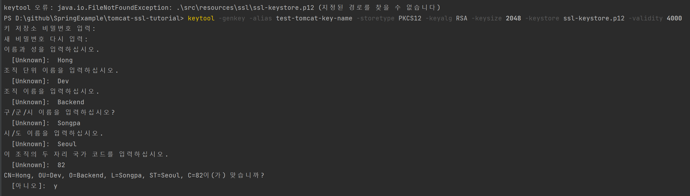
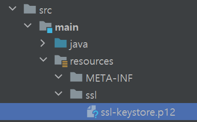

# TomcatSSL Tutorial
Spring Boot 내장 톰캣에 SSL을 적용한 예제 (https)

<br/>

# SSL 인증서 발급
## 직접 만들어 테스트
### 설명
- SSL 적용을 위한 인증서 파일 (java의 경우 keytool을 통해서도 생성 가능함.)
  - java가 설치되어있으나 keytool을 찾을 수 없다고 나오는 경우, 환경변수(JDK의 bin폴더)가 지정되지 않은 것.
  - 발급과정
    - 

### 실행 결과
- localhost 테스트
  - link: https://127.0.0.1:10443/test
  - chrome 정책으로 인해 아래와 같이 '주의요망'이 표시됨.
    - 
  - 이를 방지하기 위해서는 공인된 인증서를 사용하거나, 직접 만든 인증서를 공인시켜야함.


<br/>

## 공인된 인증서 사용
- 공인된 ssl 인증서를 발급받아 사용하는 방법
  - 유료
    - whois, 가비아 등..
  - 무료
    - lets encrypt
      - https://galid1.tistory.com/612
    - 구글 검색어
      - https://www.google.com/search?q=%EB%AC%B4%EB%A3%8C+p12+ssl&sourceid=chrome&ie=UTF-8


<br/>

# 설정
## application.yml
```yaml
server:
  port: 10443
  ssl:
    enabled: true
    key-alias: test-tomcat-key-name  # 생성시 이름과 반드시 일치해야함
    key-password: 12345678
    key-store: classpath:ssl/ssl-keystore.p12
    key-store-type: PKCS12
    key-store-password: 12345678
```

## resources/ssl 
위 경로에 아래 그림과 같이 인증파일이 위치하여있다.


    

<br/>

# 참고자료
https://www.lesstif.com/java/java-keytool-keystore-20775436.html
https://zion830.tistory.com/120