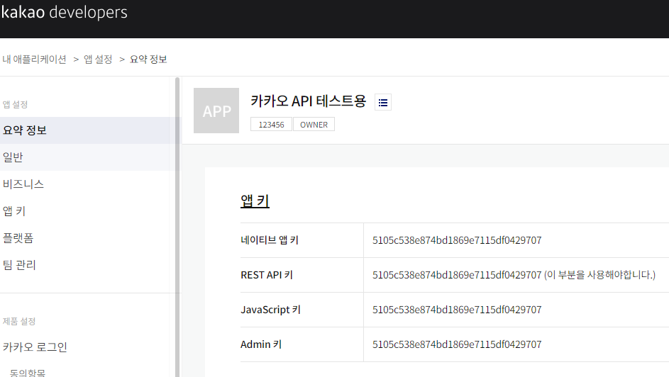

# WebClient 카카오 API 통신 예제

## applicaiton.yml
```yaml
spring:
  main:
    allow-bean-definition-overriding: true
```

## 코드
### Properties
- 카카오 base 설정 

```java
@Configuration
@Getter
public class KakaoProperties {
    private final String restApiKey = "5105c538e874bd1869e7115df0429707";
    private final String baseUrl = "https://dapi.kakao.com";
    private final String defaultHeader = "KakaoAK " + restApiKey;
}
```


- 블로그 검색 API 정보
```java
@Configuration
@Getter
public class KakaoBlogProperties {
    private final HttpMethod method = HttpMethod.GET;
    private final String path = "/v2/search/blog";
}
```

- 일반 검색 API 정보
```java
@Configuration
@Getter
public class KakaoWebProperties {
    private final HttpMethod method = HttpMethod.GET;
    private final String path = "/v2/search/web";
}
```

### Configuration
- 카카오 전용 WebClient 생성

```java
@Configuration
@RequiredArgsConstructor
public class KakaoApiConfiguration {
    private final KakaoProperties kakaoProperties;

    @Bean
    public WebClient kakaoWebClient() {
        return WebClient.builder()
                .baseUrl(kakaoProperties.getBaseUrl())
                .defaultHeader("Authorization", kakaoProperties.getDefaultHeader())
                .build();
    }
}
```

### Controller
```java
@GetMapping("/web")
public String kakaoWebSearch() {
    Mono<String> mono = kakaoWebClient.method(kakaoWebProperties.getMethod())
            .uri(builder -> builder.path(kakaoWebProperties.getPath())
                    .queryParam("query", "aaa")
                    .build()
            )
            .retrieve()
            .bodyToMono(String.class);

    // mono.subscribe(System.out::println);
    return mono.block();
}
```
        
```java
@GetMapping("/blog")
public String kakaoBlogSearch() {
    Mono<String> mono = kakaoWebClient.method(kakaoBlogProperties.getMethod())
            .uri(builder -> builder.path(kakaoBlogProperties.getPath())
                    .queryParam("query", "aaa")
                    .build()
            )
            .retrieve()
            .bodyToMono(String.class);

    // mono.subscribe(System.out::println);
    return mono.block();
}
```

